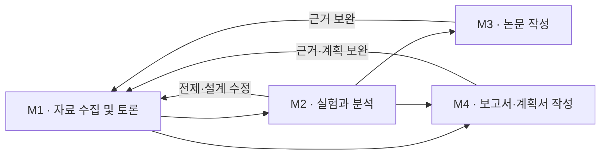

# Pilot

> **2026-09-19 실행 상태:** M1 전체 자동 실행은 아직 연결되지 않았습니다. 새 실행 생명주기는 근거 검토 한 단계에 한정되며, 단계별 모델·추론 설정과 후속 자동 배정은 미완성입니다. 프로젝트 생성이나 UI 표시를 연구 실행 시작으로 해석하지 마세요. 개발 진입점은 [현재 실행 경로와 남은 통합 작업](docs/development.md)입니다.

**근거를 모으고, 에이전트가 토론하며, 연구의 다음 방향을 정합니다.**

Pilot은 자료 수집 및 토론으로 연구 방향을 정하고 전문 도구에 작업을 의뢰하는 도메인 전문가 에이전트 오케스트레이터입니다. 어떤 결론이 나왔는지뿐 아니라 **왜 그런 결정을 내렸는지**를 대화·근거·도구 사용 기록으로 확인할 수 있습니다.

현재는 **M1: 자료 수집 및 토론**을 중심으로 개발하고 있습니다. 연구 경로에서는 실험 설계와 착수 준비까지 포함합니다. 프로젝트 관리, 연구 기록 UI, 에이전트 검토 기록, ResearchAtlas 연결을 구현했습니다. M2의 실험 실행, M3의 논문 작성, M4의 보고서·계획서 작성은 후속 개발 범위입니다.

## 연구 흐름

| 마일스톤 | 목적 | 단계 |
| --- | --- | --- |
| **M1 · 자료 수집 및 토론** | 질문·근거·방향과 실행 계획 정리 | 범위와 질문 → 자료 수집·분석·토론 → 판단 → 목적별 실행·작성 준비 |
| **M2 · 실험과 분석** | 결과로 가설을 검토하고 다음 방향 결정 | 실행 계획 확인 → 실험 → 품질 검토 → 분석 → 가설 검토 → 다음 방향 |
| **M3 · 논문 작성** | 연구 결과를 논문으로 완성 | 방향 설정 → 구조 설계 → 초안 → 교차 검토 → 수정·투고 준비 |
| **M4 · 보고서·계획서 작성** | 근거와 추진 계획을 문서로 완성 | 목적·독자·양식 확인 → 구성·초안 → 검토·수정 → 제출 준비 |

**연구는 M1→M2→M3, 조사 보고서·사업 계획서는 M1→M4, 실험 결과 보고서는 M1→M2→M4**로 진행합니다. M4는 M3 다음에 반드시 거치는 단계가 아닙니다. M3·M4는 같은 문서 작성 프로젝트에 유형별 작업을 의뢰하는 설계입니다.

현재 UI에는 기존 M1–M3 구조와 명칭이 남아 있습니다. 새 M1 분기·명칭과 M4는 설계 기준이며 아직 UI·저장 계약에 적용되지 않았습니다. M2·M3 실행도 후속 개발입니다.



M1의 목적별 경로는 **M1-1 연구 설계 / M1-2 조사·평가 / M1-3 계획 수립**입니다. [목적별 프롬프트 설계](docs/research/prompts/m1/README.md)에서 공통 규칙과 각 경로의 전문가·자료·해석·산출물 요구를 구분합니다. 현재는 설계 템플릿이며 런타임에 자동 적용되지 않습니다.

세부 책임과 목적별 산출물은 [M1–M4 운영 흐름](docs/research/guides/milestones.md)에 정리했습니다. 자료 수집은 현재 Pilot에 두며 필요할 때 분리합니다.

연구 단계와 실제 수행 순서는 별개입니다. 자료가 부족해 이전 단계로 돌아가면, 기존 결과를 덮어쓰지 않고 **돌아간 이유와 새 수행 회차**를 기록합니다. 위 흐름은 연구 설계이며, 모든 연결이 자동 실행되는 상태는 아닙니다.

## 주요 기능

| 기능 | 현재 할 수 있는 일 |
| --- | --- |
| **프로젝트 관리** | 프로젝트 생성·선택, 연구별 저장 경로와 요청 분리, 기존 연구 등록 |
| **단계별 탐색** | M1 단계의 기록 조회, 단계와 실제 수행 회차 구분, 전체 수행 이력 보기 |
| **진행 과정 보기** | 최근 작업부터 쌓이는 회차 목록에서 목적·결론·남은 문제·다음 작업 확인 |
| **에이전트 대화** | 처음 의견 → 서로의 의견 검토 → 최종 판단을 나눠 조회하고, 접힌 발언을 펼쳐 원문과 근거 확인 |
| **판단과 문제 추적** | 결정의 근거, 단계별 확인할 문제, 상태와 변경 이력 조회 |
| **자료와 근거 관리** | 후보 자료 검색, DOI·출처·확인 범위 조회, 근거 원형과 버전 연결 |
| **ResearchAtlas 연결** | 기존 지식 프로젝트 연결, 질문·후속 질문, 진행 조회, 답변과 참고 원문 수신·등록 |
| **개발 중 사람의 검토** | 대상 회차의 결론에 의견과 후속 진행·수정 요청 기록 |
| **프로젝트 자료** | 공개 문서·입력·산출물의 파일 목록 검색과 다운로드 |
| **기록 보존과 재개** | 과거 기록 시점 조회, 변경 충돌 검사, 요청 재시도와 중단 후 재개 |
| **화면 설정** | 밝게·어둡게, 왼쪽 메뉴 접기·펼치기, 모바일 메뉴, 본문 전체 폭 사용 |

프로젝트를 바꿀 때 선택과 작성 중인 입력을 연구별로 구분합니다. 답변·검토의 저장 결과가 불확실하면 같은 요청으로 확인하여 중복 실행을 방지합니다.

## 에이전트는 어떻게 연구하나요?

다음 여섯 가지 책임을 기준으로 작업에 필요한 역할을 배정합니다. 항상 여섯 에이전트가 동시에 실행되는 구성은 아닙니다.

| 역할 | 책임 |
| --- | --- |
| 조정자 | 연구 질문과 범위를 유지하고, 결과를 평가해 다음 작업 배정 |
| 자료 탐색·서지 관리 | 필요한 자료 탐색·확보, 출처·버전·원문 접근 상태 기록 |
| 분야 전문가 | 자료의 의미와 연구 대상에 대한 적용 가능성 검토 |
| 평가 방법 검토자 | 반증 조건, 비교 방법, 편향과 불확실성 검토 |
| 연구 설계·실행 검토자 | 변수·대조군·측정·분석·실행 조건 검토 |
| 판단 정리 담당 | 합의와 이견, 판단 이유, 남은 문제와 다음 행동 정리 |

같은 입력 버전으로 첫 의견을 작성한 뒤 서로의 의견을 검토합니다. 의견이 같다는 사실을 새로운 증거로 취급하지 않으며, 해결하지 못한 이견도 보존합니다. 추가 검토는 대화 횟수보다 **무엇이 부족하고 어떤 결정을 바꿀 수 있는가**를 기준으로 정합니다.

현재 연구 수행은 Codex 세션과 연결 도구를 사용합니다. UI를 켜거나 프로젝트를 만드는 것만으로 에이전트가 연구를 시작하지 않습니다. Codex·Claude·Ollama 등을 연결해 상시 토론하는 다중 모델 실행기는 아직 제공하지 않습니다.

## Pilot과 ResearchAtlas

| 구성 요소 | 역할 |
| --- | --- |
| **Pilot** | 연구 질문, 외부 자료 탐색·확보, 분석 의뢰, 가설 검토, 실험 설계, 연구 판단 |
| **ResearchAtlas** | 자료 분석과 지식 축적, 자료실 검색·질답, 출처와 미확인 범위 제공 |
| **Documents** | Atlas와 연결하는 문서 변환·추출 도구. 별도 프로젝트에서 관리 |
| **셀프드라이빙랩** | 향후 실험 실행을 맡을 별도 에이전트·장비 계층 |

Pilot 연구 프로젝트와 Atlas 지식 프로젝트는 별도로 관리하고 연결합니다. Atlas의 답변을 받는 일과 그 답변을 연구에 사용할 수 있는지 판단하는 일을 구분합니다. 원문을 받지 못한 경우에는 누락 상태를 보존하고 다시 받을 수 있습니다.

현재 Pilot의 서비스 연결은 **HTTP 클라이언트**를 사용합니다. Atlas의 API·MCP 계약 전체를 Pilot이 모두 구현했다는 뜻은 아닙니다. 지원 명령과 연결 절차는 [Atlas 연결 사용법](docs/integrations/researchatlas/pilot-t1-implementation.md), 후속 흐름은 [Atlas 연구 왕복 기록](docs/integrations/researchatlas/pilot-atlas-loop.md)을 참고하세요.

## 시작하기

### 1. 설치

Python 3.11 이상이 필요합니다. 저장소 폴더에서 실행합니다.

```sh
python3 -m venv .venv
source .venv/bin/activate
python -m pip install -e .
researchclaw-codex --help
```

제품 이름은 Pilot이며, 기존 기록과의 호환성을 위해 Python 패키지와 CLI 이름은 `researchclaw-codex`를 유지합니다.

### 2. 첫 연구와 UI 열기

```sh
researchclaw-codex research init workspaces/first-research \
  --topic "검증할 연구 질문" \
  --content-origin real

researchclaw-codex research view workspaces/first-research \
  --workspace workspaces/pilot \
  --port 8771
```

브라우저에서 **http://127.0.0.1:8771**을 엽니다. 첫 연구가 목록에 등록되며, 이후에는 왼쪽의 **+ 새 프로젝트**에서 추가할 수 있습니다. 이미 연구가 있다면 `init` 대신 기존 프로젝트 경로로 `view`를 실행합니다.

UI에서 만든 프로젝트는 근거 중심 재검토 정책을 사용합니다. 위의 첫 연구처럼 CLI `init`으로 만든 프로젝트에는 기존 횟수 설정이 유지되므로, [재검토 진행 기준](docs/research/guides/return-policy.md)에 따라 정책을 확인합니다. 프로젝트 생성은 연구 실행이나 실험 승인을 뜻하지 않습니다.

### 3. 에이전트와 연구 시작·재개

프로젝트 스킬이 노출된 Codex 환경에서 다음과 같이 요청합니다.

```text
$researchpilot
workspaces/first-research의 현재 기록을 확인하고,
연구 질문과 범위를 구체화하는 작업부터 시작해줘.
```

스킬은 저장소의 [skills/researchpilot](skills/researchpilot/SKILL.md)에 있습니다. CLI 설치와 스킬 활성화는 별개이며, 스킬이 목록에 없다면 해당 파일을 안내 기준으로 지정할 수 있습니다. 같은 연구를 재개할 때는 기존 프로젝트 경로를 사용합니다.

### 4. Atlas 연결하기 — 선택 사항

Atlas 서비스가 제공한 로컬 연결 파일을 서버에 지정합니다.

```sh
PILOT_ATLAS_CONNECTION_FILE=/path/to/atlas-connection.json \
  researchclaw-codex research view workspaces/first-research \
  --workspace workspaces/pilot --port 8771
```

`/path/to/atlas-connection.json`을 실제 연결 파일 경로로 바꿉니다. UI의 **Atlas 연결**에서 연결을 확인하고 기존 지식 프로젝트를 선택합니다. 연결 파일과 인증 정보는 서버에서 읽으며 브라우저 입력란에 토큰을 넣지 않습니다.

## 프로젝트 저장 구조

UI에서 생성한 연구는 작업 공간 아래의 별도 폴더에 저장됩니다. 프로젝트 이름이 같아도 기록을 합치지 않습니다.

```text
workspaces/pilot/
├── catalog.json                 # 프로젝트 목록과 경로 연결
└── projects/<고유 폴더 ID>/
    ├── project.json             # 이름·주제·프로젝트 ID
    ├── documents/               # 설명·검토 문서
    ├── materials/               # 공개할 입력 자료
    ├── outputs/
    │   ├── M1/                  # 실험 준비 산출물
    │   ├── M2/                  # 실험·분석 산출물용 위치
    │   └── M3/                  # 논문 산출물용 위치
    ├── runs/                    # 실행 작업 파일
    ├── .researchclaw/           # 연구 상태·버전·대화·판단 원기록
    └── .atlas-link/             # Atlas 연결 기록 — 연결 시 생성
```

M2·M3 폴더가 생성됐다고 해당 기능이 실행되거나 완료된 것은 아닙니다. 기존 프로젝트는 원래 위치에 연결하며, 해시로 참조하는 기록을 이동하거나 덮어쓰지 않습니다.

UI의 파일 목록에는 `documents`, `materials`, `outputs`만 공개합니다. 백업할 때는 작업 공간 목록과 프로젝트 폴더를 함께 보관하고, 외부 경로에 연결한 기존 연구도 포함합니다. 자세한 규칙은 [프로젝트 화면과 보관 기준](docs/research/guides/project-storage.md)에 있습니다.

## 현재 범위와 다음 개발

현재는 **M1을 실제 사례로 검증하는 POC**입니다. 기능 구현, 특정 사례의 가상 설계 검증, 실제 연구의 M1 완료를 별도로 판단합니다.

| 구분 | 상태 |
| --- | --- |
| 프로젝트 중심 UI·저장·검토 기록·Atlas 질문 왕복 | 구현 및 검증 |
| M1 연구 수행 | Codex 세션에서 도구와 기록 엔진을 사용하는 방식으로 진행 |
| UI에서 연구 전체를 무인 실행 | 미지원 |
| 자동 장비 제어·셀프드라이빙랩 연결 | 후속 개발 |
| M2 실험·해석 전체 흐름 | 설계 단계. 이전 엔진의 일부 실행 프로토콜과 구분 |
| M3 논문 및 M4 보고서·계획서 작성 | 설계 단계. 별도 작성 프로젝트에 위임 |

다음 개발에서는 좁고 검증 가능한 질문으로 M1을 시험하고, 근거에서 가설·실험 설계로 이어지는 판단의 품질을 확인합니다. 이후 M2 실행 계층과 M3·M4 문서 작성 프로젝트를 연결합니다.

## 문서와 개발

- [문서 안내](docs/README.md)
- [에이전트·프로젝트 운영 기준](AGENTS.md)
- [연구 운영 가이드](docs/research/guides/README.md)
- [UI 기준과 검수 기록](docs/ui/README.md)
- [현재 실행 경로와 이전 엔진 구분](skills/researchpilot/references/pilot-runtime.md)
- [이전 README 보관본](archive/legacy/pilot-readme-before-milestones-2026-09-15.md)

프로젝트 관리와 UI 관련 검사는 다음과 같이 실행할 수 있습니다.

```sh
python -m pip install -e '.[dev]'
python -m pytest tests/codex_native/research_graph/test_project_workspace.py \
  tests/codex_native/research_graph/test_viewer.py \
  tests/codex_native/research_graph/test_episode_http.py -q

# UI 검사에는 Node.js가 필요합니다.
node --test tests/codex_native/research_graph/*.mjs
```

브라우저에서 프로젝트 생성·전환까지 확인하는 검사는 별도의 임시 작업 공간을 사용합니다. 실행 방법과 화면별 검증 근거는 [UI 검수 기록](docs/ui/review.md)에 정리합니다.

## 원본과 라이선스

Pilot은 [AutoResearchClaw](https://github.com/aiming-lab/AutoResearchClaw)에서 출발했습니다. 원본의 고정 단계 흐름에서 프로젝트별 연구 그래프와 근거·대화 중심의 구조로 발전시키고 있습니다.

라이선스는 [MIT](LICENSE)입니다. 원본·이전 문서와 예시는 [보관함](archive/README.md)에 남깁니다.

이전 단계 기반 CLI의 승인·실행·복구 계약은 [호환 경로 운영 안내](docs/legacy-cli.md)에 별도로 보존합니다. 현재 M1 자동 실행과 구분합니다.
