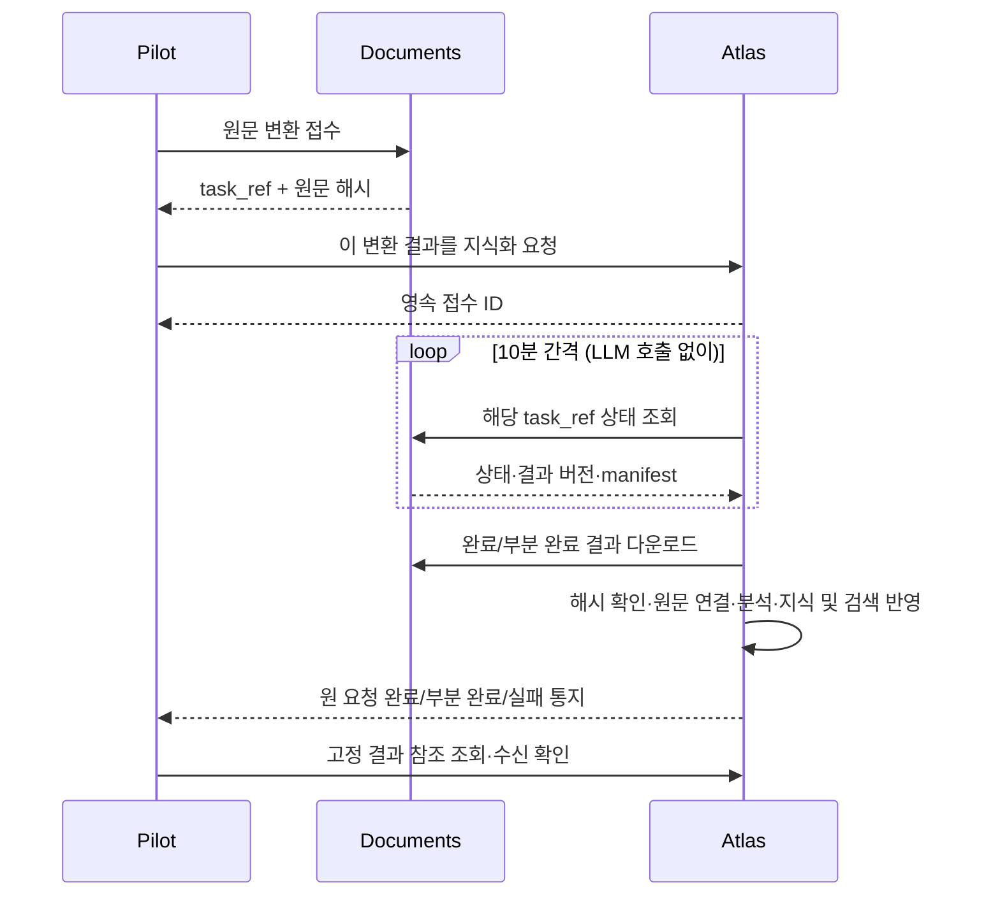

# Pilot–Documents–Atlas 문서 처리 계약 검토안

2026-09-17 · Atlas 1차 검토 반영, Documents 확인 대기. 공동 검토 요청용 초안. 사용자 합의는 역할·흐름이며 아래 신규 도구명·경로·필드는 제안이다. 구현·배포 또는 실제 새 논문 변환 접수가 아니다. 이전 Pilot–Atlas v1 규범을 임의로 변경하지 않는다.

## 목적과 책임

Pilot이 원문 확보 및 Documents 변환 요청을 맡는다. Atlas는 변환 접수 정보를 받고 Documents를 10분 간격으로 조회하여 결과를 회수·검토·지식화한다. 지식화가 끝나면 Pilot의 원래 요청에 완료 결과를 반환한다. Documents의 별도 완료 push는 필요하지 않다. 10분은 조회 주기이며 변환·연구 제한 시간이 아니다.

- Pilot: 원문·서지·연구 목적·자료 사용 질문, 변환 접수, Atlas 지식화 의뢰, 반환 결과의 연구 사용 판단.
- Documents: 비동기 변환, 작업 상태·부분 실패·버전 고정 결과 제공. 연구 해석과 위키 작성은 하지 않는다.
- Atlas: 대기 요청 영속화·주기 조회·결과 회수·원문/Markdown 연결·분석·위키/검색 반영·완료 통지.
- 개발 담당 터미널 대화, MCP 작업, Atlas QA, 영구 자료 등록은 서로 다르다. 터미널 메시지를 제품 실행 계약으로 사용하지 않는다.

## 확인한 현재 기능과 공백

| 영역 | 현재 문서/실제 확인 | 추가 합의·개발 |
| --- | --- | --- |
| Documents 변환 접수 | MCP queue_pdf_path/base64, HTTP POST /api/tasks (multipart PDF); Atlas가 운영 OpenAPI의 /api/tasks/jats 존재를 읽기 확인 | 요청 키+내용 fingerprint, 서비스 instance 식별, 모든 변환 설정의 중복 판별 |
| Documents 상태/결과 | get_task/get_artifact_manifest, GET /api/tasks/{id}, Markdown MCP resource, HTTP ZIP download | 원문·출력별 SHA-256, 불변 manifest 버전, 보관 기간·회수 ACK, 원문 전달 경로 |
| Documents 부분/재시도 | PARTIAL 종료·선택 영역 재시도·새 task_id+parent_task_id는 최신 resumable 문서에 명시 | MCP/API 동일 의미 및 운영 배포 확인. 옛 MCP Recovery의 동일 ID 설명과 충돌 정정 필요 |
| Atlas 현재 서비스 | MCP 실제 tools/list 및 info/sources 조회 성공. ask/ingest·job·QA·page/source 조회 존재 | Documents task를 받아 대기·회수·지식화하는 명시적 작업, durable poller, 완료 이벤트 |
| Atlas 자료 접수 | 현재 capability는 service_identity_v1/qa_export_v1/page_raw_v1 | 일반 ask를 문서 접수 대용으로 사용하지 않음. existing jobs 확장 여부 Atlas 결정 |
| Pilot | HTTP ask/회수/import, 프로젝트별 연결 기록 | Documents 접수 어댑터, Atlas 대기 요청, 완료 수신·상태 조정 |

근거: Documents doc/service_api.md, doc/mcp_service.md, doc/resumable_visual_extraction.md; Atlas docs/local-service.md와 실제 MCP 조회(2026-09-17). Documents 운영 API/MCP 직접 검증은 아직 하지 않았다.

현재 새 논문 DOI 10.3390/polym16192694는 Pilot에 JATS XML만 확보했다. PDF 전용이라는 최초 설명은 정정한다. Atlas는 운영 8010 OpenAPI의 /api/tasks/jats 경로 존재와 9월 14일 별도 시험의 XML 2건·그림 6개 대조 기록을 보고했다. 경로 존재와 해당 논문의 실제 처리 성공은 다르다. Documents 회신으로 JATS HTTP/MCP·부속 이미지·원문·결과 버전 계약을 확인한다. XML을 PDF로 위장하거나 불필요하게 PDF로 변환하지 않는다. HTML 지원은 별도 확인하며 표현 형식별 원문 해시를 유지한다.

## 선택지와 추천

1. **추천: Atlas가 영속 대기 요청을 소유하고 600초 주기 조회.** 사용자 합의와 일치하며 Pilot/대화창 종료와 무관하게 진행 가능하다.
2. Pilot이 끝까지 조회하고 Atlas에 넘기기: 구현은 단순할 수 있으나 Atlas가 기다린다는 합의와 다르고 Pilot 책임이 커진다.
3. Documents push/webhook: 지연은 작지만 Documents의 통지·재전송 책임이 추가된다. 현재 채택하지 않는다.

접수 직후 상태 조회 1회로 이미 완료된 재사용 작업을 감지하고, 이후 next_poll_at=마지막 시도+600초로 조회하는 안을 제안한다. 이 최초 조회 예외는 Atlas 검토 대상이다. 다수 요청에 대한 하나의 스케줄러와 작업별 짧은 실행 잠금을 사용한다. 긴 MCP 호출이나 sleeping LLM 세션을 10분 동안 유지하지 않는다. 재시작 시 중간 조회를 모두 재생하지 않고 만기 작업을 한 번 확인한다.

## MCP와 API의 공통 의미

MCP는 에이전트의 접수·조회 제어에, HTTP는 큰 원문/ZIP/이미지 바이트 전송에 사용한다. 둘은 동일 작업 ID·상태·멱등 기록을 사용한다. Atlas 내부 주기 조회는 동일 계약의 HTTP 또는 MCP 어댑터로 구현하되 별도 큐/작업을 만들지 않는다. 큰 base64를 모델 문맥에 넣지 않는다.

| 동작 | MCP | HTTP | 상태 |
| --- | --- | --- | --- |
| PDF 변환 요청 | queue_pdf_path 또는 queue_pdf_base64 | POST /api/tasks | 현재 명칭. 대형 파일 HTTP 권장; 로컬 path는 동일 호스트의 허용 경로에 한함 |
| 변환 조회 | get_task / get_artifact_manifest | GET /api/tasks/{id}, 문서화된 다운로드 경로 | 현재 명칭. manifest HTTP 대응은 담당 확인 |
| 결과 읽기 | merged-markdown resource | ZIP download | 현재. ZIP에서 원형·이미지·regions 추적 여부 확인 |
| Documents 결과 지식화 접수 | 가칭 atlas_import_from_documents | 가칭 POST /api/document-imports | 신규 제안. jobs kind 확장으로 동일 의미 구현 가능 |
| 지식화 상태·결과 | 가칭 atlas_document_import | 가칭 GET /api/document-imports/{id} | 신규 제안. 기존 job 조회 재사용 우선 |
| 완료 통지·복구 | 가칭 atlas_events/ack | 가칭 GET /api/events?cursor= / POST /api/events/ack | 신규 제안. 기존 지원인 것처럼 호출 금지 |

Atlas 1차 검토에 따라 **Pilot 서비스가 Atlas 영속 이벤트를 조회하고 event_id별 ACK**하는 방식으로 좁힌다. webhook은 첫 범위에서 제외한다. terminal 상태·고정 결과 참조·이벤트를 같은 DB 트랜잭션으로 보존한다. Pilot은 결과를 영속화한 뒤 ACK한다. 최소 1회 전달이며 중복/역순 이벤트는 import/result ID로 조정한다. cursor는 조회 위치일 뿐 누적 ACK가 아니다. consumer 간 ACK는 거절하고 ACK 유실 재전송은 같은 결과로 수렴한다. ACK는 연구 채택·M1 완료·원본 삭제 허가가 아니다. Pilot이 꺼져 있으면 이벤트를 보존하고 재접속 후 회수한다. 이벤트 보관 기간과 cursor 만료 시 상태 재조정은 공동 확정 전이다. Documents에는 push를 요구하지 않는다.

Atlas는 **별도 영속 import 요청과 기존 ingest 실행기 재사용**을 권고하며 Pilot은 이를 수용한다. 변환 대기를 Codex running job으로 만들지 않는다. 기존 A1 ask와 서버 재시작 시 기존 queued/running ask·ingest 자동 실행 금지를 유지한다. import 조회기는 만기 상태 확인만 복구하고, 자신이 만든 ingest만 연결한다. organizing 중단은 작업·이미 반영된 파일을 조정한 뒤 안전한 재개 여부를 판단하며 불명확하면 needs_attention으로 남긴다. lease 세대 번호로 이전 실행자의 늦은 쓰기를 거절한다.

상태는 phase(accepted/waiting_conversion/fetching/organizing/terminal)와 outcome(completed/partial/failed/cancelled 또는 null)을 분리하는 안을 채택한다. needs_attention은 조치가 필요한 정지 상태다. 원래 Documents 상태를 별도로 보존한다. 요청한 색인의 조회 가능 여부도 완료 조건에 포함하며 사용하지 않는 선택 색인은 not_requested로 구분한다.

## 최소 접수·반환 정보

Atlas 접수 요청:
- contract_version, request_key, 정규화 fingerprint; pilot_project_id와 atlas_project_id를 별도로 명시.
- documents_service_ref(서버 측 등록 별칭 및 고정 instance ID), task_id, 알려진 parent_task_id, 원문 SHA-256·MIME·파일명·서지·출처 URL.
- 연구 목적과 질문, 정리 범위, 부분 결과 사용 정책, 원문 접근 참조. 프로젝트/권한을 파일 내용으로 덮어쓰지 않음.
- 완료를 받을 Pilot consumer ID. 토큰·임의 callback URL·서버 절대 경로는 payload에 넣지 않음.

접수 반환: import/job ID, receipt, 고정된 요청 fingerprint, 현재 상태·다음 조회 시각. 같은 request_key+내용은 같은 결과; 다른 내용은 충돌. Documents가 멱등 요청 키를 아직 지원하지 않으면 그 공백을 표시하고 응답 유실 시 해시·설정·기존 작업으로 먼저 대조한다. force/rerun을 자동 선택하지 않는다.

Documents 결과 manifest: 서비스 instance/task/result revision, parent, 원문 해시, 변환기·설정 버전, 상태, Markdown/원문/이미지/regions별 논리 ID·크기·해시·조회 참조, 누락 영역과 오류. 경로 대신 권한이 확인된 자료 참조를 사용하고 반환 바이트를 검증한다.

Atlas 완료 반환: 원 요청 ID·Documents 결과 참조·Atlas instance/source ID/version·변환 연결 ID·wiki page/hash·실제 읽은 범위·미해결·검색 색인 상태·event ID/sequence. completed는 약속한 정리 범위가 완료되고 조회 가능한 상태이며, 전체 과학적 정확성이나 Pilot 연구 채택을 뜻하지 않는다. QA 작성·파일 다운로드만으로 completed 금지.

## 상태·복구·부분 결과

제안 흐름은 앞 절의 phase/outcome 구분을 따른다. 오류에는 원인·retryable·다음 조회 또는 조치 조건을 반환한다. 세 서비스의 원래 상태를 손실 없이 보존하고 사용자에게는 변환 대기/변환 중/지식 정리 중/정리 완료/일부 정리/확인 필요로 표현한다.

- QUEUED/PROCESSING: 600초 뒤 조회. 시간 경과만으로 FAILED 또는 새 변환 접수를 생성하지 않음.
- COMPLETED: 결과 manifest와 바이트를 고정 후 지식화. 문헌의 모든 축을 읽었다고 확대하지 않음.
- PARTIAL: 사용할 수 있는 본문부터 정리하고 regions의 실패/미확인을 보존. 누락 그림·표에 의존하는 주장만 보류. 정리 결과도 partial로 반환하고 빈틈을 성공으로 감추지 않음.
- FAILED/삭제/404/권한 오류: 무한 재시도 대신 상태·이유를 Pilot에 알림. 일시 통신 오류만 다음 주기 재조회. 인증 복구 필요는 needs_attention.
- 재시도: 새 child task를 명시적으로 연결하고 이전 산출물을 유지. 임의의 '최신 task'로 갈아타지 않음. 같은 원문 해시이면 source/version을 유지하고 새 extraction/result 및 위키 수정 이력을 남김. 실제 원문 바이트 변경에만 source 새 버전을 연결하며, 변환 결과 변경을 원문 변경으로 기록하지 않음.
- 서버 중단: next_poll_at/lease/최종 관측/결과 참조를 영속 저장; lease 만료 후 단일 실행 복구. 중복 poll/다운로드/완료 이벤트는 같은 결과로 수렴.
- Pilot의 Documents 성공 뒤 Atlas 접수 실패: Pilot outbox가 같은 요청 키로 재전송. Documents 작업은 다시 만들지 않음.
- 자료 회수 보장: Documents 보관 기간/삭제 계약 합의. 가능하면 Atlas 회수 ACK 전 자동 삭제하지 않음; 미지원이면 운영 보관 정책과 미회수 경고로 시작.
- Atlas 대기 취소와 Documents 변환 취소는 별개. 여러 연구가 공유할 수 있으므로 Atlas 요청 취소가 원 작업 삭제를 의미하지 않음.

## 작게 나눈 구현·수락 기준

1. 문서/운영 capability 확인: PDF/XML 지원, job identity/manifest/retry 차이 정정. 서비스 중단·연구 상태 변경 없음.
2. Pilot → Documents 접수 및 영수증 보존. 같은 파일 재전송·응답 유실에도 중복 변환 방지.
3. Pilot → Atlas 대기 접수. 두 호출 사이 장애 후 동일 요청 복구, 프로젝트 소속 보존.
4. Atlas 600초 조회기. 가상 시계로 599/600초, 재시작·동시 worker·일시 장애·FAILED·PARTIAL 검증.
5. Atlas 결과 회수·지식화. 해시 불일치 차단, 부분 자료 사용, 이미지/표 원문 위치, 중복 import 방지, 새 버전 보존.
6. 완료 통지. Pilot 중단/ACK 유실/중복·역순 이벤트에도 결과 하나로 표시, 복구 조회 지원.
7. 실제 논문 1건: 변환 요청→지식화→Pilot 검색으로 새 논문이 출처와 함께 반환됨. QA만 남고 자료 목록에 없는 경우 실패.

## 담당 검토 요청

Atlas: 기존 jobs에 필요한 확장 방식, durable scheduler, 원문/변환 접수 경계, 지식화 완료 정의, 통지·ACK·검색 반영의 최소 구현을 제안해 주세요.
Documents: 현재 운영 MCP/API 목록과 입력 형식, task identity/해시/manifest/원문 접근, PARTIAL/child task/버전, 10분 조회·보관 정책·멱등 처리 가능 여부를 답해 주세요. XML 미지원 시 PDF 경로를 명시해 주세요.
Pilot: 접수 영수증/outbox/프로젝트 대응/결과 수신과 UI 연결을 맡습니다. 각 담당은 자기 프로젝트 검토 문서에 수용·수정·미지원·수락 시험을 남기고 경로를 회신합니다. 이 초안을 동시 편집하거나 코드·배포·실제 변환을 시작하라는 요청이 아닙니다.

## 공동 검토 이력

- Atlas 1차 검토: [검토 문서](/Users/jspark/orca/projects/ResearchAtlas/docs/integrations/documents-atlas/polling-handoff-review-2026-09-17.md). Pilot은 600초 조회, 별도 durable import+기존 ingest 실행기, 조회형 영속 이벤트/event ID ACK, 원문과 변환 버전 분리, 기존 A1/재시작 경계 보존을 수용한다.
- Documents 회신 전: JATS MCP/부속 이미지, instance/task/result/hash/manifest, 원문 조회·인증·보관, 멱등 요청 계약은 미확정.
- 구현·배포·새 논문 접수·연구 재개는 실행하지 않았다.
