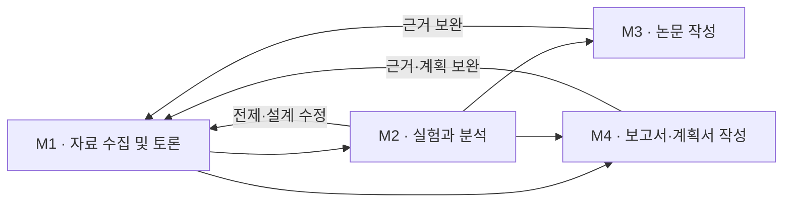

# Pilot의 역할과 M1–M4 흐름

2026-09-16 사용자 합의 정리. 역할과 흐름의 설계 기준이며, UI·실행 엔진 구현 완료를 뜻하지 않는다.

## Pilot의 역할

Pilot은 도메인 전문가 에이전트를 조율한다. 자료 수집 및 토론을 통해 이론·근거·반론을 종합하고, 단계별 판단과 다음 작업을 정해 전문 프로젝트의 MCP/API 또는 에이전트에 의뢰한다. 반환 결과가 연구 질문에 답하는지 검토하고 판단 이유·입력과 결과 버전·진행 이력을 보존한다.

검색·서지 정리·원문 확보는 현재 Pilot에 둔다. 독립적인 운영 필요가 생기면 분리를 검토한다. 별도 수집 프로젝트를 지금 만들지 않는다. 단순 조회마다 여러 에이전트의 토론을 강제하지 않고 중요한 가설·설계·결론 판단에 독립 검토와 교차 검토를 적용한다.

## 마일스톤

| 구분 | 목적 | 넘길 결과 |
| --- | --- | --- |
| M1 · 자료 수집 및 토론 | 질문·목표·범위 설정, 근거 검토, 방향과 실행 계획 결정 | 목적별 판단·근거·미확인 사항·다음 작업 의뢰 |
| M2 · 실험과 분석 | 실험 수행, 결과 품질·분석·가설 검토, 다음 방향 결정 | 실행·분석 결과, 해석·한계, 추가 실험 또는 작성 의뢰 |
| M3 · 논문 작성 | 연구 주장과 결과를 논문으로 완성 | 검토된 원고·그림·표·인용·보충자료·투고 자료 |
| M4 · 보고서·계획서 작성 | 조사·연구 결과 또는 추진 계획을 목적과 양식에 맞게 작성 | 보고서 또는 계획서, 근거·가정·위험·증빙 |

M1은 자료를 모으는 데서 끝나지 않는다. 연구 경로에서는 가설과 실험·분석 설계, 실행 조건과 준비 확인까지 포함한다. 보고서 경로에서는 보고 목적·핵심 결론과 근거·구성안, 계획서 경로에서는 목표·전략·추진 방법·일정·자원·가정과 위험을 정리한다. 계획의 가정을 검증된 성과로 표현하지 않는다.

## M1 목적별 경로와 프롬프트

M1-1 **연구 설계**, M1-2 **조사·평가**, M1-3 **계획 수립**으로 나눈다. 순차 단계가 아니라 주 목적이며 공통 수집·토론·판단 구조에 목적별 자료·페르소나·해석·산출물 요구를 적용한다. 혼합 업무는 주 경로 아래 하위 과업으로 연결한다. [프롬프트 설계와 템플릿](../prompts/m1/README.md)을 따른다. 현재 실행기에 자동 주입되는 기능은 아니다.

## 목적에 따른 경로

- 실험 연구와 논문: M1 → M2 → M3.
- 조사 보고서·사업 계획서: M1 → M4.
- 실험 결과 보고서: M1 → M2 → M4.
- 새 실험이 필요 없는 문헌 연구 논문은 M1에서 작성에 필요한 근거 충족 여부를 검토한 뒤 M3로 갈 수 있다. 실험하지 않은 M2를 완료로 기록하지 않는다.

M4는 M3 뒤에 반드시 거치는 단계가 아니다. 마일스톤은 작업의 성격을 구분하며, 수행 순서는 별도 기록한다. 작성 중 추가 실험이 필요하면 Pilot이 M1 설계 보완과 M2 실행 의뢰를 결정한다.

## 전문 프로젝트와의 경계

- Atlas: 자료·지식·근거의 보관과 검색·분석. Documents: 문서 변환·추출.
- Standard: 지원 분야의 용어·출처 조회. Tabular: 데이터·실험 결과 관리.
- AutoML: 학습·평가. MOO: 후보 조건 추천. Presentation: 발표 자료·시각화.
- 별도 실행 계층: 사람·장비·계산 작업의 실행과 실패·재개 관리.
- 별도 문서 작성 프로젝트: 논문·보고서·계획서 초안, 수정본, 양식과 제출 파일. M3·M4에서 공통으로 이용하되 유형별 검토 기준을 둔다.

도구의 작업 완료와 Pilot의 결과 채택은 구분한다. 실행 계층과 문서 작성 프로젝트의 세부 계약은 후속 설계이며, 기존 프로젝트도 연결이 모두 완료된 것은 아니다. 원자료와 상세 실행 기록은 담당 도구가 보관하고 Pilot은 버전이 고정된 참조와 판단 근거를 보존한다. 기존 Atlas의 출처·오류·재개 계약을 축소하지 않는다.

## 구현과 보존

현재 UI와 저장 계약은 기존 M1–M3 구조다. M1 명칭·목적별 분기, M3 명칭 통일, M4 화면·저장·의뢰 계약은 후속 구현 대상으로 둔다. 문서 변경만으로 기존 상태나 완료 조건을 바꾸지 않는다. 기존 연구·대화·원문·실행 이력은 그대로 보존한다.
