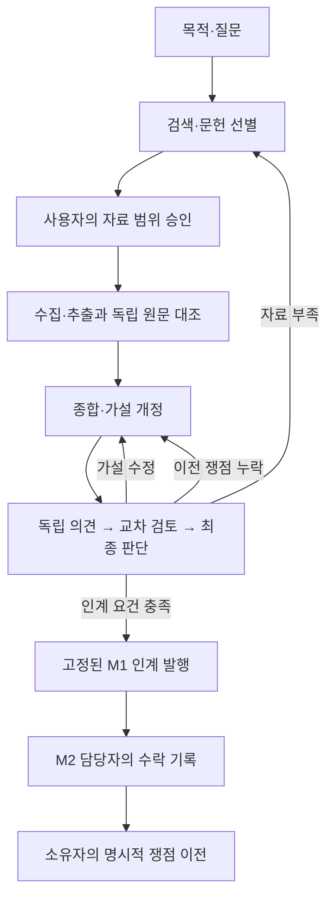

# M1 연결 B01–B07 검증 기록

상태: B01–B07 백엔드 연결 완료. 기준 a4388da → 519a7f6. 기능별 독립 검토와 묶음 통합 리뷰를 통과했고, 최종 관련 검사 **438개가 573.82초에 모두 통과**했다.

| 작업 | 확인물 | 상태 |
|---|---|---|
| B01 | 출처 수와 공유 원천 구분 | 완료 · 78a8e73 · 19개 검사 · 독립 검토 통과 |
| B02 | 최초 비공개·단계 공개·실제 호스트 관측 | 완료 · ab07e88 · 23개 검사 · 독립 검토 통과 |
| B03 | 사용자 목적·가정·질문 협의 연결 | 완료 · 1b06db7 · 26개 검사 · 독립 검토 통과 |
| B04 | 검색·선별과 정확한 문헌 승인 | 완료 · f11b3a1 · 15개 검사 · 독립 검토 통과 |
| B05 | 독립 원문 대조·접근 범위 | 완료 · 5c59905 · 14개 본 검사 + 6개 입력 회귀 · 독립 검토 통과 |
| B06 | 이전 여섯 쟁점과 가설 개정 연결 | 완료 · 42251aa · 12개 고유 검사 + 실제 6개 쟁점 조회 · 독립 검토 통과 |
| B07 | 인계 발행·수신 수락 분리 | 완료 · 519a7f6 · 11개 고유 사례 + 토론 25개 검사 · 독립 검토 통과 |

## 이번 연결의 흐름

아래는 B01–B07에 구현한 백엔드 연결이다.

각 개정은 이전 버전과 검토 기록을 보존한다. 인계 발행·수락만으로 실험이 시작되거나 쟁점이 해결되지는 않는다.

## 실제 호스트 관측

현재 Codex 서브에이전트의 `functions.exec → tools.exec_command`에서 다른 역할 폴더의 합성 테스트 파일을 읽는 데 성공했다. 읽은 파일의 SHA256과58바이트 길이를 주 에이전트가 대조했다. 이 환경에서는 공유 폴더 경로만으로 파일 접근 격리가 강제되지 않으므로 `isolation_level=instructions_only`로 기록한다. 다른 호스트·도구·격리 설정은 검사하지 않았다. 이는 실제 도구 접근 관측이며 연구 자료의 과학적 검증이 아니다. API 패킷의 본문·해시 비공개는 별도 테스트로 확인한다.

## 기존 여섯 쟁점의 기준 상태

가져온 사례의 입력은 합성 자료다. 여섯 쟁점은 모두 `pending_policy_revalidation`, `category=other`, 담당자 미지정 상태다. 세 blocking 쟁점은 M1 review를 막는 범위가 지정되어 있다. 아래 쟁점은 모두 열린 상태로 보존되어 있으며 새 가설 작성만으로 해결된 것으로 처리하지 않는다. B06 읽기 전용 조회에서 여섯 쟁점 모두 `unaccounted`·`unresolved`로 표시되는 것을 확인했다. 담당자·처리 기록과 새 단계가 없으므로 `ready=false`이며, 조회 전후 입력 스냅샷과 원본 HEAD는 동일했다.

| 기존 쟁점 | 중요도 | 검토 질문 |
|---|---|---|
| `I-critical-2` | major | 독립 검토자가 동일하게 적용할 수 있도록 모든 하위 집단의 범위와 개선·개선 없음의 판정 규칙을 어떻게 고정할 것인가? |
| `I-method-2` | major | 검증 대상인 모든 하위 집단의 범위와 개선의 측정 기준을 어떻게 정하고, 불확실성이 큰 추정치와 실제 비개선을 어떻게 구별해 반증할 것인가? |
| `I-critical-1` | blocking | 집단별 결과가 없는 상태에서 구성비 차이의 대안 설명을 배제하고 모든 집단의 개선을 어떻게 식별하는가? |
| `I-method-1` | blocking | 조건별 집단 구성비가 다른 상태에서 집계 평균의 개선이 모든 하위 집단의 효과를 보여준다는 추론을 어떤 집단 내 비교와 식별 조건으로 정당화할 것인가? |
| `I-domain-2` | major | 어떤 대상과 하위 집단, 결과 지표 및 개선 판정 규칙으로 보편 예측과 구성 효과라는 대안을 구별하고 반복 검증할 것인가? |
| `I-domain-1` | blocking | 집계 평균의 개선만 제시된 상태에서 모든 하위 집단에 효과적임을 보여준다고 진술할 근거는 무엇인가? |

세 개의 blocking 쟁점은 집계 개선에서 모든 하위 집단의 효과로 넘어가는 추론을 다룬다. 세 개의 major 쟁점은 대상 범위·판정 기준·불확실성을 구체화하도록 요구한다. 개별 원문과 해결 조건은 보존하며 단순히 M2로 넘기기 위해 쟁점 종류를 바꾸지 않는다.

## 재현 가능한 연결 지점

아래는 새 연구 그래프 저장소를 사용하는 백엔드 API다. 실제 멀티 모델 실행이나 새 UI 화면의 완주 확인과는 별도다.

| 단계 | 명령·조회 | 보존하는 판단 근거 |
|---|---|---|
| 출처 묶음 | `group_origins` | 인용된 출처와 공유 원천·알 수 없는 원천 |
| 독립 검토 | `council.prepare`, `council.submit`, `reviewer_packet` | 최초 의견, 공개 시점, 반박, 최종 판단 |
| 목적·질문 | `m1.node.register`, `prepare_scope_council` | 사용자 목적과 에이전트 가정, 개정 사유, 이전 쟁점 |
| 검색·선별 | `prepare_search_council`, `corpus_status` | 검색 기록, 포함·제외 이유, 전체 자료 범위 |
| 문헌 승인 | `m1.corpus.decide`, `m1.corpus.bind` | 사용자가 선언한 결정, 정확한 자료 버전, 철회·재승인 |
| 원문 대조 | `m1.evidence.assign`, `m1.evidence.observe`, `prepare_evidence_check`, `current_evidence` | 제공된 원문·접근 수준·문자 위치, 독립 확인 결과, 불일치와 재검증 |
| 가설 검토 | `prepare_hypothesis_review` | 근거·반대 근거, 기각 대안, 이전 쟁점별 담당·처리·실제 검증 결과 |
| 가져온 쟁점 연결 | `m1.issue.materialize` | 기존 쟁점을 바꾸지 않는 명시적 등록, 이후 별도 검증·담당 지정 |
| M1 인계 | `m1.handoff.issue`, `m1.handoff.receiver.assign`, `m1.handoff.accept` | 고정 보고서·자료 버전, 수신 책임, 쟁점 이전과 분리된 수락 |
| 작업 집계 | `m1.work.record`, `work_ledger.refresh` | 실제 기록에서 유도한 작업 목록·개정·검증 시작 횟수, 비용 미상 상태 |

공개 명령은 `commands.apply_command`의 등록 목록을 통해 실행한다. 문헌 승인 명령은 실제 사용자의 결정을 전달하는 경로이며 에이전트의 최종 의견에서 자동 생성하지 않는다. 이 개발 배치에서 실행한 승인 사례는 합성 테스트뿐이다.

## 원문 확인의 범위

B05의 원문은 명령에 제공된 UTF-8 캡처다. 네트워크에서 실제 문헌을 가져왔다는 증명이나 출판물 자체의 진위 확인은 아니다. 독립 확인은 해당 캡처와 추출문을 대조하며 해석과 접근 한계를 별도로 기록한다. 이 배치에서는 합성 입력을 사용한 백엔드 경로를 검사했다.

판정 불가 또는 실패한 이전 검증은 새 자료 버전으로 별도 Verification을 준비하고 독립 판정을 받아 재검토할 수 있다. 원래 쟁점·판정 기준·결과 바이트는 보존된다. 쟁점을 삭제하거나 자동 해결하는 경로를 추가하지 않았다.

## 인계 조회 성능

동일한 합성 인계 스냅샷에서 상태 조회를 측정했다. 한 조회 안에서 노드 검토 642회와 검토자 패킷 구성 597회가 반복되는 경로를 제거했고, 계측 도구 없이 잰 조회 시간은 20.39초에서 0.49초로 줄었다. 이는 한 사례의 측정값이다.

조회마다 비어 있는 내부 캐시를 새로 만들며, 과거 스냅샷도 별도로 검사한다. 다음 조회에 추가된 쟁점·변경된 승인 상태는 재검사하며 호출자가 보낸 준비 상태나 전역 캐시를 신뢰하지 않는다.

## 최종 확인

원본 85개·가져온 76개 파일은 해시, 수정 시각, 파일 목록이 모두 동일했다. 기존 여섯 쟁점의 읽기 전용 조회도 최종 코드에서 다시 통과했다. 묶음 통합 리뷰와 `.venv/bin/python -m pytest tests/codex_native/research_graph -q`의 438개 검사를 모두 통과했다. UI와 실제 멀티 모델 연구 실행은 별도 수용 단계다.

최종 근거 파일: [관련 테스트 로그](../../../.superpowers/sdd/m1-b01-b07/final-tests.log), [실제 여섯 쟁점 조회](../../../.superpowers/sdd/m1-b01-b07/actual-issues-after.json), [호스트 접근 관측](../../../.superpowers/sdd/m1-b01-b07/host-access-observation.json), [파일 보존 확인](../../../.superpowers/sdd/m1-b01-b07/preservation-after.json).

다음 구현은 E01의 M1 읽기 전용 조회 연결이다. 이후 화면에서 대화·판단 근거·미해결 쟁점·복귀 이유를 확인하는 흐름을 연결한다. 현재 기존 사례의 여섯 쟁점은 해결된 것으로 간주하지 않는다.
