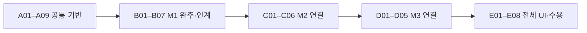

# M1·M2·M3 공통 연구 운영 확장 Implementation Plan

> **For agentic workers:** REQUIRED SUB-SKILL: Use superpowers:subagent-driven-development (recommended) or superpowers:executing-plans to implement this plan task-by-task. Steps use checkbox (`- [ ]`) syntax for tracking.

**Goal:** 쟁점·검증·판단·근거 계보를 M1부터 M3까지 보존하고 사용자가 왜 결정됐는지 추적하게 한다.

**Architecture:** 공통 연구 운영 기반 + 마일스톤별 adapter + 읽기 전용 전체 UI. 새 버전/별도 프로젝트에 명시적으로 가져오고 기존 M1·legacy 경계를 보존한다.

**Tech Stack:** Python >=3.11, pytest, node:test, vanilla JS, 기존 호스트/계산형 실행 계약.

**Spec:** [확장 설계 기준](../specs/2026-09-09-research-governance-design.md).

## Global Constraints

- Python >=3.11, 기존 pytest·node:test·vanilla JS 사용. 새 프레임워크/외부 서비스 추가 없음.
- 신규 workflow_version=research-graph-v1, schema_version=1. 기존 M1·숫자 단계 root·승인·기록 불변.
- 신규 root의 .researchclaw/research_graph에 단일 authoritative HEAD. atomic write, expected_head, command_id replay 필수.
- 조정자 대필·자기 승인 금지. transferred≠resolved. 부정 결과·불확실·실패·예산 중단 구분.
- 기존 실행/비용/사용자 승인 유지. 외부 게시·실험 자동 실행·실사용 설치는 이 계획으로 승인하지 않음.
- 모든 입력·판단은 정확한 버전 참조. confidence 합의 임계값 없음. 실제 관측과 synthetic fixture 분리.

## 현재 상태와 이번 산출물

설계와 작업 분할만 작성했다. 아래 작업은 전부 미착수다. 기존 M1 Task01은 전체 기준선 제한이 있고 Task02–15는 해당 범위 구현/검토 기록이 있다. Task16은 UI 연결 구현/코드 검토 완료지만 Chrome 접근 차단으로 시각 수용 미완료다. 기존 Task17–20은 미완료이며 아래 대응표로 승계한다. M2/M3는 기존 숫자 단계 기능이 일부 있어도 새 그래프 연결이 완료된 것이 아니다.

## 실행 순서와 확인 지점

공통 기반부터 작은 작업을 순차 검토한다. B01은 A08, B02는 A06 이후 독립 검토 가능하지만 동일 저장/CLI 파일 수정은 직렬화한다. 사용자 승인 대기 없이 진행할 수 있는 구현 단계와, 실제 문헌·설계·실행·최종 결정이 필요한 수용 단계를 구분한다. UI가 마지막에 처음 보이는 문제를 줄이기 위해 A03/B06/C06/D03 완료마다 기존 읽기 전용 inspect와 기록 보고서로 확인물을 제공한다. E01은 B07 뒤 M1-only projection부터 구현 가능하고 M2/M3 collection은 각 완료 뒤 연결하되 E01 완료 판정은 D05 이후다.

| 묶음 | 작업 수 | 확인 지점 | 상세 계획 |
|---|---:|---|---|
| A 공통 연구 운영 기반 | 9 | 기존 쟁점 보존·검증·복귀 이유 | [A 상세](2026-09-09-research-governance-core.md) |
| B M1 보완과 인계 | 7 | seed 없이 M1 인계 | [B 상세](2026-09-09-research-governance-m1.md) |
| C M2 실험·해석·방향 | 6 | 실제 실행 근거와 다음 방향 | [C 상세](2026-09-09-research-governance-m2.md) |
| D M3 주장·심사·최종화 | 5 | 주장과 근거·심사·최종 패키지 | [D 상세](2026-09-09-research-governance-m3.md) |
| E 전 과정 UI·평가·수용 | 8 | 전체 타임라인·실패 경로·설치본 | [E 상세](2026-09-09-research-governance-acceptance.md) |

## 작은 작업판

| ID | 작업 | 선행 | 사용자 확인물 | 상태 |
|---|---|---|---|---|
| A01 | 공통 기록·참조 계약 | 없음 | 어떤 기록으로 쟁점·검증·결정을 연결할지 JSON 예제를 확인한다. | 미착수 |
| A02 | 저장 공통부와 신규 버전 격리 | A01 | 기존 M1 기록이 그대로 열리고 신규 기록은 다른 root에서만 생성된다. | 미착수 |
| A03 | M1 기록의 명시적 가져오기 | A02 | 현재 실제 검토 사례를 새 프로젝트에서 동일하게 조회한다. 기존 심사/승인 완료를 새 정책 통과로 간주하지 않는다. | 미착수 |
| A04 | 쟁점 전이·이관·재개 | A03 | 한 쟁점이 M1→M2로 옮겨도 열린 문제로 남는 것을 확인한다. | 미착수 |
| A05 | 검증 작업과 결과 등록 | A04 | 토론에서 실제로 수행한 확인과 아직 안 한 확인을 구분한다. | 미착수 |
| A06 | 입장 변화·요약 근거 연결 | A05 | 누가 어떤 이유로 판단을 바꿨는지 원문까지 확인한다. | 미착수 |
| A07 | 마일스톤별 차단·인계 판정 | A06 | 단순 반대와 실제 진행 차단, M2에서 확인할 질문을 구분한다. | 미착수 |
| A08 | 의존 관계와 변경 영향 | A07 | 왜 일부 결과만 다시 검토하는지 목록을 확인한다. | 미착수 |
| A09 | 반복·비용 예산과 안전한 재개 | A08 | 무한 토론 대신 무엇이 필요해서 멈췄는지 확인한다. | 미착수 |
| B01 | 공통 원천과 근거 의존성 | A08 | 근거가 많아 보이는 이유가 실제 다양성인지 확인한다. | 미착수 |
| B02 | 독립 패킷·공개·호스트 관측 | A06 | 공유 자료와 비공개 최초 의견을 구분하고 실제 실행 확인 범위를 본다. | 미착수 |
| B03 | 목적·질문 협의 연결 | B02,A07 | 연구 질문이 왜 선택됐는지 확인한다. | 미착수 |
| B04 | 검색·선별 협의와 문헌 승인 | B03 | 검색 범위·문헌 제외 이유·사용자 승인 경계를 확인한다. | 미착수 |
| B05 | 수집·추출의 독립 원문 대조 | B04,A05 | 에이전트 대화 외에 실제 원문 대조가 수행됐는지 확인한다. | 미착수 |
| B06 | 종합·가설과 이전 쟁점 재검토 | B05,B01 | 이번 실제 사례의 여섯 쟁점이 수정 가설에서 어떻게 처리됐는지 확인한다. | 미착수 |
| B07 | M1 인계 발행과 수신 준비 | B06,A09 | M1 종료 상태와 M2에서 담당할 검증 질문을 확인한다. | 미착수 |
| C01 | M2 인계 수락과 설계 질문 배정 | B07 | M1 쟁점이 M2의 어떤 설계 질문이 되었는지 확인한다. | 미착수 |
| C02 | 설계·판정 기준 고정과 독립 심사 | C01,B02 | 실험 전에 무엇을 성공·실패·판정 불가로 볼지 확인한다. | 미착수 |
| C03 | 기존 구현·실행 준비 계약 연결 | C02 | 실행할 코드·환경·예산과 아직 실행하지 않았다는 상태를 확인한다. | 미착수 |
| C04 | 실행 성공·실패와 결과 무결성 등록 | C03,A05 | 어떤 실행에서 나온 결과인지와 실패 원인을 확인한다. | 미착수 |
| C05 | 독립 분석·대안 설명·쟁점 판정 | C04,B02 | 결과가 가설을 지지·반박·판정 불가 중 어디까지 말하는지 확인한다. | 미착수 |
| C06 | 연구 방향·복귀·M3 인계 | C05,A08,A09 | 더 실험할 이유와 멈출 이유, M1으로 돌아갈 근거를 확인한다. | 미착수 |
| D01 | 최종 주장과 근거 범위 연결 | C06 | 보고서 각 주장에 어떤 근거와 한계가 있는지 확인한다. | 미착수 |
| D02 | 본문·도표·재현 안내 버전 등록 | D01 | 본문·그림과 실제 결과가 같은 버전인지 확인한다. | 미착수 |
| D03 | 독립 심사와 쟁점별 수정·역방향 복귀 | D02,B02,A08 | 심사 의견이 문장 수정인지 새 연구가 필요한 문제인지 확인한다. | 미착수 |
| D04 | 최종 출처·무결성·재현 감사 | D03 | 최종 패키지에서 빠진 근거와 재검토할 항목을 확인한다. | 미착수 |
| D05 | 사용자 최종 결정과 로컬 보관 | D04 | 승인한 버전과 전달 파일이 일치하는지 확인한다. | 미착수 |
| E01 | 전 과정 읽기 전용 조회·CLI 서버 | B07,C06,D05 | 명령으로 현재·과거 연구 전체 기록을 조회한다. | 미착수 |
| E02 | 마일스톤 지도와 공통 쟁점 타임라인 | E01 | 하나의 쟁점을 M1→M2→M3까지 따라간다. | 미착수 |
| E03 | 결정·입장 변화·주장과 원천 탐색 | E02 | 왜 이 결론인지와 독립 근거가 얼마나 있는지 원문으로 확인한다. | 미착수 |
| E04 | 신규 프로젝트 전체 연구 경로 | E03 | 성공·부정 결과·역방향 복귀가 원문 기록으로 이어지는지 본다. | 미착수 |
| E05 | 동시성·중단 복구·기존 프로젝트 보존 | E04 | 실패한 작업과 재개 지점, 기존 프로젝트가 그대로인지 확인한다. | 미착수 |
| E06 | 실제 역할·브라우저 수용 | E05 | 대화 원문과 화면의 결정·쟁점·이동이 일치하는지 직접 확인한다. | 미착수 |
| E07 | 단일·다중 에이전트 품질 평가 | E04 | 오류 발견·잘못된 해소·불필요한 반복·비용에 실제 이점이 있었는지 본다. | 미착수 |
| E08 | 설치본·사용 안내·최종 작업판 | E03,E05 | 설치본에서도 연구 결정과 원문을 확인하고 미완료 검증 목록을 본다. | 미착수 |

## 기존 M1 계획과 대응

| 기존 작업 | 이번 계획에서의 처리 |
|---|---|
| Task01 전체 기준선 제한 | E05에서 기준선과 비교하고 미해결 실패를 별도 기록; 이전 결과를 전체 통과로 변경하지 않음 |
| Task02–15 기존 구현 | A02 회귀·A03 명시적 가져오기로 보존; B 작업은 신규 버전 연결 |
| Task16 시각 수용 미완료 | E06에서 실제 브라우저 확인. 접근 차단 시 미완료 유지 |
| Task17 초기 협의 | B03 목적/질문, B04 검색/선별, B05 수집/추출 대조, B06 종합/가설로 분할 |
| Task18 인계 | B07 발행, C01 수신 수락으로 분할 |
| Task19 통합·복구·호환성 | A02 저장 회귀와 E04–E06 전체 수용으로 분할 |
| Task20 설치·실사용 | E06 실제 호스트/사용자 수용, E08 설치본·안내로 분할 |

이 대응은 기존 작업 완료 표시가 아니다. 기존 E 계획과 새 B/E 계획을 중복 실행하지 않는다. 기존 m1-graph-v1에서 먼저 완주할 필요가 생기면 별도 범위 결정이 필요하며 새 계획의 자동 전제가 아니다.

## 설계 규칙과 검사 대응

| 규칙/시나리오 | 구현 작업 | 최종 확인 |
|---|---|---|
| G01/G05 독립성·역할, S10 | B02, B03–B06, C02/C05, D03 | E06 실제 호스트 관측·읽기 범위 한계 |
| G02/G07 쟁점·인계, S01/S02 | A03/A04, B06/B07, C01 | E02/E04 타임라인 |
| G03/G04 검증·변경, S07 | A05/A06, C04/C05 | E03 원문·입장 확인 |
| G06 원천 의존성, S03 | B01/A08 | E03 |
| G08/G09 변경 영향·수렴, S04/S06/S08 | A02/A08/A09, C06/D03 | E04 |
| G10 승인·부정 결과, S05/S09 | B04/B07, C02–C06, D04/D05 | E04 |
| G11 UI·S11 설치 | E01–E06/E08 | 브라우저·격리 wheel 확인 |
| G12 품질·S12 | E07 | 실제 측정 보고; 개선 여부 미리 판정하지 않음 |

## 점검·보고 규칙

- [ ] 각 작업은 실패 검사 → 최소 구현 → 통과 → 독립 검토 → 커밋으로 마감한다.
- [ ] 자동 테스트, 실제 호스트 관측, 실제 연구 실행, 시각 수용, 설치 검증을 별도 열로 기록한다.
- [ ] 현실의 자료 부족·반려·예산 한계는 실제 대기로 남긴다. 성공을 만들려고 합의·실험 결과를 생성하지 않는다.
- [ ] 전체 구현 시작 권한은 이번 설계 요청에 포함하지 않는다. 다음 구현 시작점은 A01이며 A01–A03을 첫 검토 묶음으로 제안한다.

총 35개 작업이다. 일정은 작업 수로 추정하지 않는다. A01–A03의 실제 변경량과 회귀 결과를 본 뒤 이후 묶음의 실행 예상치를 갱신한다.

E06의 브라우저/사용자 승인 대기는 독립적인 E07 평가와 E08 설치 검증을 막지 않는다. 전체 수용 완료 판정은 세 작업의 실제 결과가 모두 있어야 한다.
