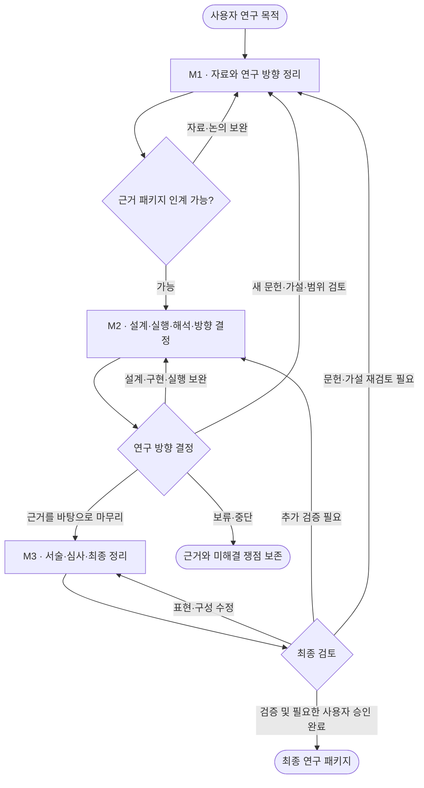
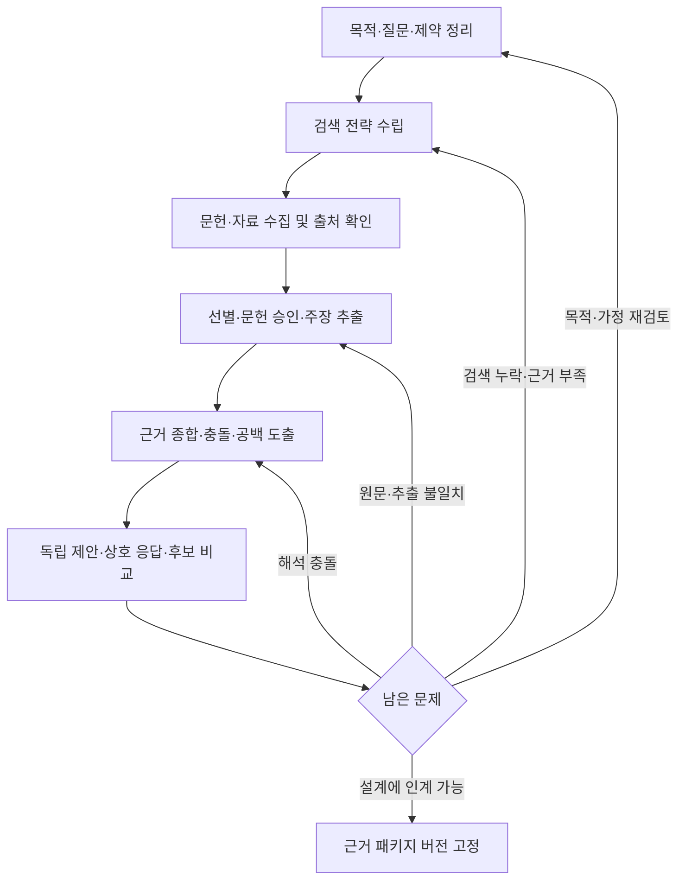
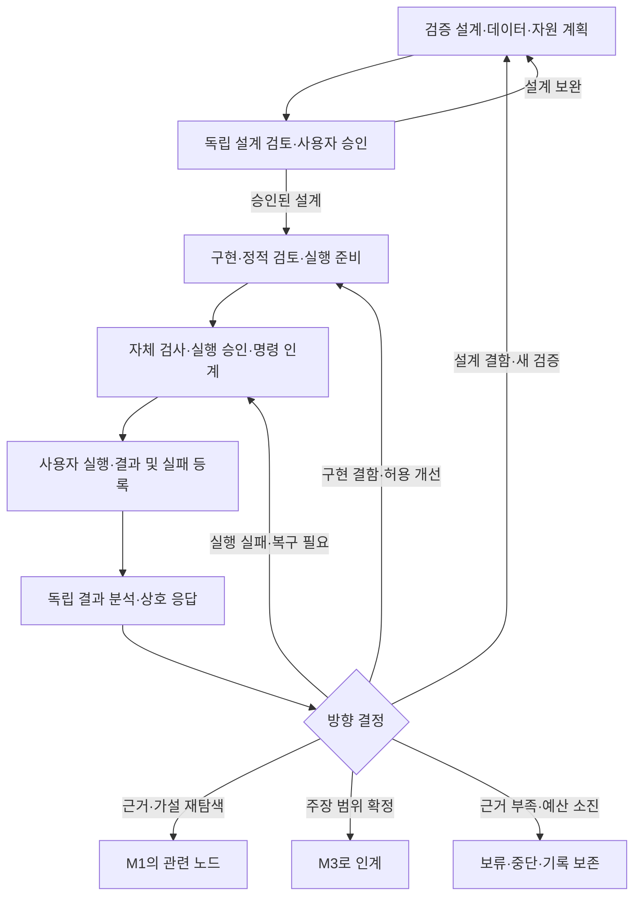
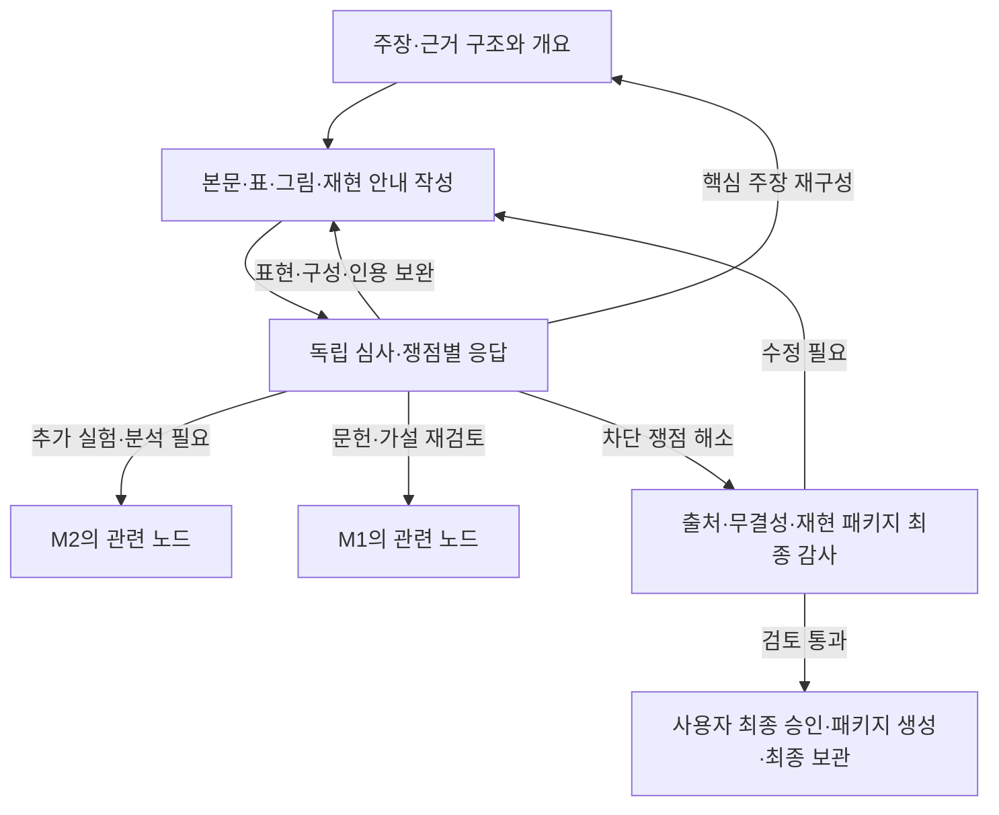
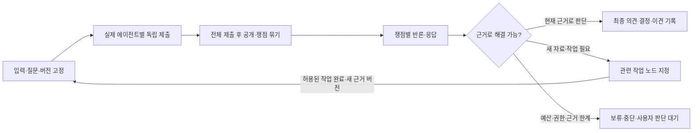

# 세 마일스톤 기반 연구 그래프 설계

> 2026-09-09 확장: [공통 연구 운영 설계](2026-09-09-research-governance-design.md)가 전 과정 쟁점·검증·인계·재개 계약을 구체화한다. 기존 프로젝트의 실행 규칙 변경이나 구현 완료를 의미하지 않는다.

작성일: 2026-09-08

상태: 사용자와 합의한 세 마일스톤 방향을 구체화한 검토용 초안. 이 문서는 연구 엔진 구현·기존 프로젝트 이전·신규 승인 정책 적용을 의미하지 않는다.

## 1. 목표와 경계

사용자는 실제 독립 에이전트들이 자료를 수집하고 쟁점을 도출하며, 서로의 근거에 응답하고, 연구 방향과 다음 작업을 결정하는 과정을 보고자 한다.

기존 23단계를 그대로 재번호화하지 않는다. 세 마일스톤 안에 작업·협의·검증 노드를 두고, 근거와 쟁점에 따라 필요한 노드로 돌아가는 그래프로 구성한다.

- M1: 실험 설계 전까지 자료 탐색·검증·종합·논의를 통해 연구 방향 후보와 근거 패키지를 정리한다.
- M2: 실험 설계부터 구현·실행·분석을 수행하고, 진행·보완·전환·보류·중단을 결정한다.
- M3: 승인된 근거를 바탕으로 연구를 서술·심사·수정하고 최종 결과물을 정리한다.
- 현재 지원되는 계산형 실행 범위는 유지한다. 그래프 정의만으로 실험실형·정책 근거형 실행 기능이 생기지 않는다.
- 연구 협의와 사용자 승인은 구분한다. 기존 문헌·설계·실행 승인 경계를 생략하지 않는다.

## 2. 전체 그래프

위의 큰 노드로 향하는 복귀 화살표는 해당 마일스톤 전체를 다시 수행한다는 뜻이 아니다. 복귀 결정에 지정된 세부 노드에서 새 회차를 시작한다. 예산·권한을 초과하는 작업은 대기 상태로 두고 자동 실행하지 않는다.

## 3. M1 — 자료 수집·협의·연구 방향 정리

### 역할과 페르소나

| 역할 | 책임·판단 습관 | 핵심 질문 |
| --- | --- | --- |
| 분야 연구자 | 연구 맥락·현상·기여를 검토하고 경쟁 방향을 제안 | 어떤 공백이 실제로 중요하며 기존 연구와 무엇이 다른가? |
| 정보 탐색자 | 검색 범위와 출처를 추적하며 반대 근거도 탐색 | 다른 용어·자료원·부정적 결과를 놓치지 않았는가? |
| 근거 분석자 | 주장·수치·조건·한계를 원문 위치와 연결 | 원문 관측과 작성자의 해석을 구분했는가? |
| 방법론 연구자 | 문헌 간 비교 가능성과 가설의 검증 가능성 판단 | 연구 조건이 달라 생긴 차이를 모순으로 오해하지 않았는가? |
| 비판·독립 확인자 | 원문 대조, 선택 편향, 반대 설명·미확인 근거 점검 | 무엇이 밝혀지면 후보 방향을 철회해야 하는가? |
| 조정자 | 쟁점 목록과 후보 비교를 관리하고 인계 자료 작성 | 결정에 필요한 근거가 무엇이며 어떤 이견이 남았는가? |

자료 작성과 독립 대조는 서로 다른 실행 주체가 수행한다. 모든 역할을 모든 노드에 동시에 배치하지 않는다. 판단 협의에는 분야·방법론·비판 역할을 배치한다.

### 완료 산출물과 인계 조건

- 연구 목적·세부 질문·제약·사용자 요구와 가정의 구분.
- 검색 기록, 선별 사유, 필요한 문헌 승인, 출처·접근 수준 목록.
- 주장–출처–조건을 연결한 근거표와 종합 문서.
- 충돌·공백·미해결 쟁점 목록.
- 후보 가설·경쟁 설명·우선 검증 방향과 선택·보류 이유.
- M2가 설계해야 할 검증 질문과 필요한 입력의 목록.

M1의 완료는 가설이 참이라는 합의가 아니라 실험 설계를 시작할 정도로 질문과 근거가 정리됐다는 뜻이다. 모순된 문헌도 검증 질문으로 명료하게 정리되면 남길 수 있다. 핵심 출처 불명, 무단 변경된 문헌 승인, 목표의 결정적 모호성처럼 설계를 무효하게 만드는 문제는 먼저 해결한다.

대조군·데이터 분할·최종 지표·실행 예산의 상세 설계는 M2에 둔다. M1에서는 명백히 불가능한 방향을 피할 수준의 데이터·자원 제약만 확인한다.

## 4. M2 — 실험 설계·수행·해석·방향 결정

### 역할과 페르소나

| 역할 | 책임·판단 습관 | 핵심 질문 |
| --- | --- | --- |
| 분야 연구자 | 검증의 현실 적합성과 결과의 의미 판단 | 이 실험이 실제 연구 질문에 답하는가? |
| 방법론·분석 연구자 | 대조·분할·지표·불확실성과 경쟁 설명 검토 | 관측 결과로 어떤 가설을 구별할 수 있는가? |
| 구현자 | 승인된 설계를 코드·설정·검사로 구현 | 각 구현이 설계의 어느 조건을 충족하는가? |
| 데이터·자원 담당자 | 입력 준비·환경·자원·실행 인계 관리 | 실제 준비 사실과 추정치를 구분했는가? |
| 비판·재현성 확인자 | 설계·코드·결과 대조, 누출·과적합·무결성 검토 | 개선이 평가셋 적응이나 실행 조건 차이 때문은 아닌가? |
| 조정자 | 분석과 방향 결정을 분리해 기록하고 후속 작업 연결 | 추가 작업으로 무엇이 달라지며 비용이 정당한가? |

구현자는 자신의 결과를 독립 평가하거나 승인하지 않는다. 결과 분석은 투표로 사실을 정하는 과정이 아니다. 판단 역할은 실제 결과에 근거해 방향을 권고한다.

### 인계와 반복 규칙

- 실행 결과와 실패 기록, 입력·코드·환경의 버전, 분석·반론·최종 권고를 연결한다.
- 매 실행 뒤 결과의 유효성과 의미를 검토한 다음 개선 여부를 결정한다. 개선은 필수 통과 단계가 아니다.
- 유효한 부정적 결과나 개선 없음도 M3에 인계할 수 있다. 긍정적 성능 향상을 완료 조건으로 두지 않는다.
- 새 설계는 해당 설계 승인을 다시 거친다. 새 실행·자체 검사는 기존 계약의 승인·확인 경계를 따른다.
- 현재 CLI는 실험 준비만으로 본 실험을 실행하지 않는다. 그래프에서도 사용자 실행과 결과 등록을 분리한다.
- 기존 13단계의 제한된 후보 개선 프로토콜, 14단계의 분석 종합, 15단계의 전원 일치 규칙은 기존 프로젝트에서 유지한다. 새 그래프에 자동으로 동일 규칙을 이식하지 않는다.
- 기존 13단계를 새 분석 이후 흐름에서 재사용하려면 상태·근거 계약 연결이 필요하다. 기존 명령의 호출 순서만 바꿔 구현했다고 간주하지 않는다.

M3 인계물은 검증 가능한 연구 기록, 근거가 지지하는 주장과 지지하지 않는 주장, 한계·미해결 사항, 마무리 권고 및 필요한 사용자 결정이다. 인계 자체가 출판 승인이나 과학적 타당성 인증은 아니다.

## 5. M3 — 연구 서술·심사·최종 정리

### 역할과 페르소나

| 역할 | 책임·판단 습관 | 핵심 질문 |
| --- | --- | --- |
| 연구 작성자 | 근거에 맞게 논리·본문·표·그림·수정 대응 작성 | 어떤 근거가 각 문장과 도표를 지지하는가? |
| 분야 심사자 | 기여·맥락·주장 범위를 독립 심사 | 기존 연구와 구별되는 기여를 과장하지 않았는가? |
| 방법론 심사자 | 설계와 분석 설명의 충분성·정확성 확인 | 결과 해석을 재검토할 정보가 충분한가? |
| 재현성·출처 감사자 | 코드·데이터·인용·주장의 연결 확인 | 승인된 증거와 최종 배포본이 일치하는가? |
| 기록·패키지 담당자 | 검증된 버전과 재현 자료를 묶어 보관·내보내기 | 빠진 자료나 다른 버전이 섞이지 않았는가? |
| 조정자 | 심사 쟁점의 해결·미해결과 복귀 결정 관리 | 문장 수정으로 해결 가능한가, 새 근거가 필요한가? |

완료는 최종 산출물·심사 대응·출처 검증·한계 고지·재현 자료의 일치와 필요한 사용자 승인을 뜻한다. 외부 제출·공유는 별도 명시적 권한이 필요하다. 최종 산출물 형식은 사용자 목적에 맞춰 논문·연구 보고서·재현 패키지로 정한다.

## 6. 모든 협의 노드의 공통 루프

- 기본 응답 라운드는 한 차례다. 추가 협의는 새 근거·새 질문·허용 예산이 있을 때만 새 회차로 기록한다.
- 쟁점이 없으면 확인 범위와 함께 없다고 보고한다. 토론량을 채우려고 반론을 만들지 않는다.
- 조정자는 타인의 발언·최종 의견·합의를 작성하지 않는다.
- 실제 실행 식별자를 기록하고 확인되지 않으면 미확인으로 표시한다. 같은 에이전트가 여러 독립 생산자를 흉내 내지 않는다.
- 개별 필수 역할의 제출 실패를 합의로 취급하지 않는다. 재시도·대체 배정·대기 사실을 표시한다.
- 각 쟁점은 ID, 제기자, 대상 버전, 근거, 영향, 중요도, 해소 조건, 응답, 처리 결과와 다음 담당을 가진다.
- 사실·계산 문제는 확인으로 해결한다. 연구 가치·범위 선택과 사실의 참거짓을 같은 투표로 처리하지 않는다.
- 신규 그래프의 정족수·합의 정책은 별도 설계 항목이다. 이 초안은 기존 규칙을 변경하거나 신규 자동 진행 권한을 부여하지 않는다.

## 7. 루프·그래프 상태와 공통 검증

노드는 작업 또는 협의를, 연결선은 조건부 이동을 나타낸다. 마일스톤은 관련 노드 묶음과 인계 결과물이다. 단순히 현재 단계 번호를 증가시키는 방식으로 표현하지 않는다.

- 노드 상태: 준비 전, 수행 가능, 진행 중, 검토 대기, 사용자 결정 대기, 완료, 보류, 실패.
- 연결 기록: 출발·도착 노드, 쟁점 ID, 복귀 이유, 사용 근거 버전, 수행할 작업, 영향받는 산출물·승인, 허용 예산.
- 재방문: 과거 완료 기록을 덮어쓰지 않고 새 회차를 생성한다. 하위 산출물의 영향 여부를 확인하고 필요한 부분만 재검토한다.
- 수렴: 새로운 근거·허용 작업이 없으면 같은 논의를 자동 반복하지 않는다. 예산·회차 상한에 도달하면 근거 상태를 보존하고 대기·중단한다.
- 후보 병행: 승인된 범위에서 독립 작업만 병행할 수 있다. 후보별 입력·결정·결과는 분리하고 비교 시 공통 기준을 명시한다.
- 공통 기능: 출처·주장 연결, 불변 증거, 승인, 예산, 변경 영향, 실행 출처와 이견 기록은 세 마일스톤 전체에 적용한다.

인용 검증은 M1부터 반복하고 M3 최종 패키지의 선행 조건으로 둔다. 기록 보존은 매 노드에서 수행하며 M3의 최종 보관으로 대체하지 않는다.

## 8. 사용자에게 보여줄 시각적 정보

- 세 마일스톤의 전체 위치와 조건이 적힌 복귀선.
- 선택한 노드의 질문·역할·입력·산출물·완료 조건.
- 실제 에이전트의 최초 제안, 쟁점별 응답, 최종 의견과 변화 이유.
- 이번 회차가 이전 회차와 다른 이유 및 새로 들어온 근거.
- 다음 행동, 작업 담당, 진행 차단 사유, 필요한 사용자 결정.

이 문서의 도식은 설계도다. 실행 현황·에이전트 대화·완료 상태를 시뮬레이션해 실제 기록처럼 표시하지 않는다. 실시간 기록 연결과 클릭 가능한 실행 화면은 후속 제품 구현 범위다.

## 9. 원본 23단계 대응과 이행

| 원본 기능 | 새 위치 |
| --- | --- |
| 1~2 주제·문제 정의 | M1 목적·질문 |
| 3~6 검색·수집·선별·추출 | M1 근거 확보 |
| 7~8 종합·가설 | M1 쟁점·후보 방향 |
| 9 설계 | M2 검증 계획 |
| 10 코드·11 자원 | M2 구현·준비. 초기 제약은 M1에서도 확인 |
| 12 실행 | M2 실행 인계·결과 등록 |
| 13 개선 | M2 분석·결정 후 선택하는 제한된 반복 작업 |
| 14~15 분석·결정 | M2 해석·방향 결정 |
| 16~19 작성·심사·수정 | M3 서술·심사 루프 |
| 20 품질 승인·22 내보내기 | M3 최종 감사·승인·전달 |
| 21 보관·23 인용 검증 | 전 과정 공통 기능 + M3 최종 확인 |

기존 프로젝트의 상태·승인·증거·규칙은 유지한다. 새로운 그래프는 별도 워크플로 버전으로 개발한다. 현재 검증기와 증거 보존 기능은 재사용 가능성을 확인하되, 숫자 단계에 결합된 상태 전환·전용 명령은 별도 어댑터 또는 계약 변경이 필요하다.

M1 인계 확정과 기존 문헌 승인, M2 연구 방향 합의와 사용자 실행 승인, M3 심사 완료와 사용자 최종 승인을 각각 구분한다. 신규 마일스톤 승인 버튼이나 기존 승인 통합 정책은 아직 정하지 않았다.

## 10. 설계 검증과 후속 개발 단위

### 수용 시나리오

1. 자료 누락: M1 협의에서 검색으로 복귀하고 새 문헌을 반영한 의견 변화가 추적된다.
2. 해석 불일치: 문헌의 충돌을 숨기지 않고 검증 질문으로 M2에 전달한다.
3. 설계 결함: 구현 전에 발견한 누출 문제로 설계를 수정하고 필요한 승인을 다시 받는다.
4. 실행 실패: 결과를 조작하지 않고 실패 기록·복구·승인 경계를 보존한다.
5. 유효한 부정적 결과: 개선을 강제하지 않고 한계와 근거를 갖춰 M3로 진행할 수 있다.
6. 근거 부족·예산 소진: 강제 합의·강제 진행 없이 보류·중단한다.
7. 심사 중 실험 결함: M3에서 M2의 정확한 노드로 돌아가고 영향을 받는 원고만 새 버전으로 검토한다.
8. 기존 프로젝트: 새 그래프 도입으로 과거 승인·증거·완료 판정이 변경되지 않는다.

### 개발 분할

1. 이 설계와 노드·연결·인계·승인 정책 확정.
2. 그래프 상태와 읽기 전용 시각화·기록 조회 기반.
3. M1의 실제 독립 수행·협의·인계 연결과 수용 검사.
4. M2의 기존 실행·증거·협의 계약 연결 및 루프 검증.
5. M3의 작성·심사·최종화와 이전 마일스톤 복귀.

현재 문서는 설계 결과물이며 제품 코드나 실행 가능한 연구 기능을 추가하지 않는다.

## 참고

- [현재 개발 현황](../../../archive/legacy/2026-09-19-project-cleanup/docs/CODEX_DEVELOPMENT_STATUS_KO.md)
- [기존 단계별 역할 설계](../../../archive/legacy/2026-09-13-design-reset/docs/superpowers/specs/2026-09-07-stage-agent-roles-design.md)
- [원본 단계 정의](https://github.com/aiming-lab/AutoResearchClaw/blob/main/researchclaw/pipeline/stages.py)
- [원본 토론 설계](https://github.com/aiming-lab/AutoResearchClaw/blob/main/docs/debate_engine.md)
- [원본 실행 흐름](https://github.com/aiming-lab/AutoResearchClaw/blob/main/researchclaw/pipeline/runner.py)
