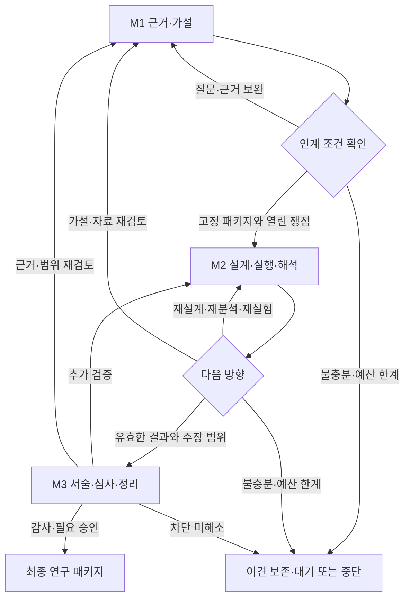
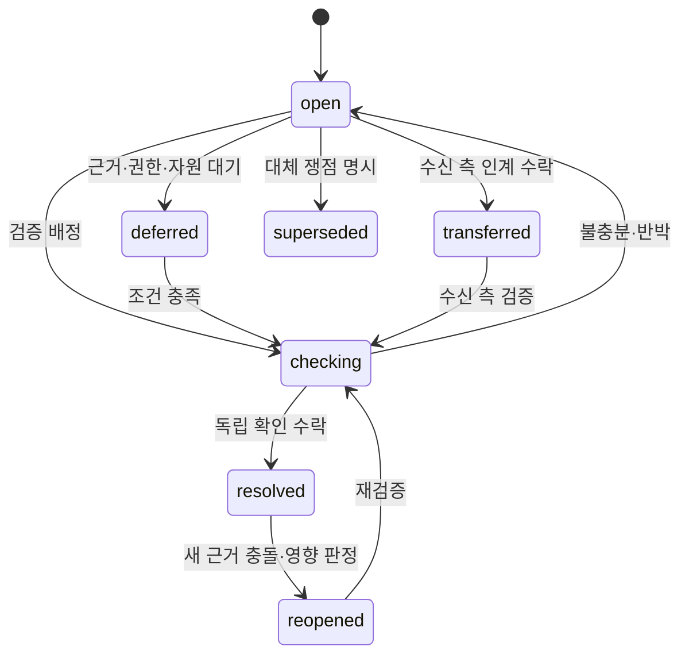

# M1·M2·M3 공통 연구 운영 설계 기준

작성일: 2026-09-09 · 상태: 사용자 요청으로 확장한 설계·작업 분할. 제품 구현 아님.

## 1. 합의와 변경 범위

기존 [세 마일스톤 설계](2026-09-08-three-milestone-research-graph-design.md)의 목적·단계·승인 경계를 유지한다. 이 문서는 공통 쟁점·검증·결정·인계 계약을 구체화하며 충돌 시 신규 워크플로에 대해 우선한다. 기존 M1/숫자 단계 프로젝트의 동작은 변경하지 않는다.

사용자는 독립 에이전트의 실제 발언과 그로부터 연구 방향이 결정되는 이유를 보고자 한다. 완료의 기준은 대화량·동의율·긍정 결과가 아니라 필요한 확인이 수행되고 미해결 사항과 주장 범위가 정확히 남는 것이다.

접근안 비교:

| 접근 | 장점 | 비용·한계 |
|---|---|---|
| M1 내부에 M2/M3 조건 추가 | 초기에 적은 파일 변경 | 가설 전용·단계 전용 판정이 계속 섞임 |
| 공통 기록·정책 + 마일스톤별 어댑터 (선택) | 동일 쟁점을 전 과정 추적하고 기존 계약 격리 | 명시적인 가져오기·호환성 검증 필요 |
| 엔진 전체 재작성 | 단일 새 구조 | 이미 검증한 저장·실행 기능까지 재구현하는 범위 증가 |

선택한 구조는 공통 운영 모듈을 추가하되 기존 실행기의 검증 가능한 결과만 어댑터로 가져온다. 실행 승인·프로세스 실행 권한을 새로 만들지 않는다.

## 2. 공통 규칙 (G01–G12)

- G01 독립성: 동일 입력 snapshot으로 최초 판단; 전원 제출 후 공개. 작성자는 자기 결과를 독립 승인하지 않는다. 모델·호스트 식별자는 관측 범위를 표시하며 통계적 독립성 보증으로 쓰지 않는다.
- G02 쟁점 연속성: 마일스톤·회차가 바뀌어도 같은 issue_id를 유지한다. 새 쟁점 없음, 담당 이전, 문구 개정은 해소 증거가 아니다.
- G03 검증 행동: 각 차단 쟁점에는 구체적 확인 질문·방법·판정 조건·담당·예산이 필요하다. 원문 대조, 논리 대조, 계산, 실험, 사람 판단을 구분한다.
- G04 입장 변경: 근거 추가, 기존 근거 재해석, 논리 오류 인정, 목표·제약 변경 중 변경 원인과 정확한 참조를 기록한다. 자기 확신도는 선택적·미보정 정보이며 합의 임계값으로 사용하지 않는다.
- G05 역할 책임: 찬반 결론을 강제하지 않는다. 조정자는 질문·대안을 정리하고 타인의 최종 입장을 대필하거나 차단을 무시할 수 없다.
- G06 근거 의존성: 원문·데이터셋·실행 원천의 공유를 기록한다. 출처 수나 동의자 수를 독립 증거 수로 바꾸지 않는다. 원천이 불명확하면 unknown이다.
- G07 인계: 미해결 질문은 담당·해소 조건·다음 검증을 명시해 전달하고 수신 측이 수락한다. transferred는 resolved가 아니다.
- G08 변경 영향: 새 근거·가설·분석·원고 버전이 생기면 의존하는 결론·승인의 유효성을 재검토한다. 과거 객체는 보존하며 현재 사용 가능 여부만 별도 판단한다.
- G09 수렴: 동일한 질문·근거·작업의 반복은 자동 진행하지 않는다. 예산 소진·필수 역할 미제출은 완료가 아니라 대기·중단이다.
- G10 승인: 기존 문헌·설계·실행 승인 경계를 유지한다. 새 실행·비용 증가·외부 제출을 검토 의견이나 마일스톤 완료로 승인하지 않는다.
- G11 UI: 허용 경로와 실제 이동을 구분한다. 현재 상태와 과거 snapshot을 혼합하지 않는다. 선언된 출처·호스트 관측·실제 연구 검증 범위를 구분한다.
- G12 평가: 알려진 오류 발견·잘못된 채택·잘못된 해소·불필요한 반복·시간/비용을 측정한다. 고정 자료에서 단일 에이전트와 비교하며 개선을 미리 보장하지 않는다.

## 3. 전체 흐름과 쟁점 생명주기

각 화살표는 구체적인 milestone/node/attempt를 지정한다. 전체 마일스톤 초기화를 뜻하지 않는다.

superseded는 후속 issue_id가 필수이며 해소로 계산하지 않는다. 쟁점 병합·분할도 원본을 남기고 successor_ids를 연결한다. 상태 변경은 append-only event이며 임의 status 덮어쓰기를 제공하지 않는다. transferred 기록에는 to_milestone, owner_assignment_id, verification_id, acceptance_event_id가 필요하다.

## 4. 공통 데이터 계약

모든 기록은 schema_version=1, workflow_version=research-graph-v1, project_id, id, event/producer 식별자와 content_origin(real|synthetic|mixed)을 가진다. content_origin과 provenance_status(declared_only|host_observed)는 별개다. host_observed는 관측 증거 참조가 있을 때만 사용하며 서명 인증을 뜻하지 않는다.

| 객체 | 필수 내용 | 불변 조건 |
|---|---|---|
| SnapshotRef | project_id, head_id, artifact_id, sha256 | 같은 id의 다른 bytes를 수락하지 않음 |
| Issue | origin(milestone,node,attempt,local_issue_id), question, category, target_refs, severity, blocking_scope, resolution_condition, owner_assignment_id | 동일 프로젝트 전역 ID; blocking_scope는 노드/인계/최종화 대상 목록 |
| IssueEvent | issue_id, from_status, to_status, actor_assignment_id, rationale, verification_refs, successor_ids | 전이 순서·독립 확인·현재 binding 검사 |
| Verification | issue_ids, method, question, input_refs, acceptance_rule, owner_assignment_id, budget_ref | 수행 전 기준 고정, 새 기준은 새 revision |
| VerificationResult | verification_id, output_refs, outcome(supported|refuted|inconclusive|failed), checked_scope, limitations | 작업 완료와 과학적 지지를 분리 |
| Position | assignment_id, session_id, input_binding, issue_id, stance, rationale, evidence_refs, changed_from, change_kind | 공개된 동일 snapshot, 변경 원인과 실제 참조 |
| Decision | issue_ids, position_refs, claim_dispositions, rationale_links, dissent, next_action, gate_result | 각 결론이 발언·검증에 연결; 조정자 대필 금지 |
| Handoff | from/to_milestone, source_head, artifact_refs, unresolved_issue_ids, transfer_proposals, limitations, acceptance_ref | 발행과 수신 수락 분리; 자동 실행 없음 |
| Dependency | from_ref, to_ref, relation(supports|derived_from|tests|reports), origin_group_id | 순환·불명 대상 거부; unknown 원천을 독립으로 계산하지 않음 |
| ApprovalBinding | existing_receipt_ref, scope_refs, binding, validity | 기존 승인 권한 유지; 변경 영향 발생 시 재검토 |

모든 dict payload는 객체별 닫힌 필드 계약과 enum을 A01에서 고정한다. ID는 UUID 기반이며 가져온 M1 issue는 source_project/head/session/local_id 매핑표로 안정적으로 대응한다. 역사적 참조는 현재 최신 객체로 자동 치환하지 않는다.

## 5. 독립 검토와 진행 정책

공통 협의는 입력 고정 → 독립 최초 제출 → 공개 → 쟁점별 응답 → 최종 입장 → 결정 검증이다. 추가 토론은 새로운 확인 질문·근거·허용 작업이 있을 때 새 session으로 연다. 모델 혼합은 설정 옵션이며 필수 전제나 정확성 점수로 사용하지 않는다.

공통 입력·공개 결과는 공유 저장하고, 공개 전 패킷은 호스트별 허용 입력으로 분리한다. 단순 프롬프트와 파일 분리는 접근 통제가 아니다. 호스트가 읽기 범위를 강제할 수 없으면 isolation_level=instructions_only를 기록한다. 이를 isolated로 표시하거나 최초 의견 비열람을 인증하지 않는다. 독립성 필수 평가에서는 그 실행을 비교군에서 구분한다.

판정은 두 층이다. 형식·출처·필수 제출·현재 승인·차단 쟁점 확인은 결정적으로 검증한다. 과학적 충분성은 독립 역할이 증거와 기준에 대해 판단한다. 구조 검사를 통과했다는 이유로 사실이 확인됐다고 표시하지 않는다.

필수 분야·방법론·비판 역할의 입장은 모두 남긴다. 반대 의견은 blocking_scope와 acceptance_rule에 연결돼야 한다. 연결이 없으면 조정자가 무시하지 않고 입장 보정을 요청한다. 선택적 개선은 인계를 자동 차단하지 않으며 남은 이견으로 기록한다. 유효한 차단에 대한 이견은 추가 독립 확인이나 사용자의 범위 축소로 처리한다. 범위 축소는 새 목표/가설 revision이며 원래 주장이 검증됐다는 뜻이 아니다. confidence 수치나 다수결로 차단을 지우지 않는다.

## 6. 마일스톤별 역할·산출물·게이트

| 단계 | 작성·수행 | 독립 검토 페르소나 | 완료/인계 조건 |
|---|---|---|---|
| M1 질문·검색·선별 | 분야 작성자, 탐색자 | 분야: 가치·누락 / 방법론: 비교 가능성 / 비판: 선택 편향 | 질문·허용 자료·승인·검색 한계가 명시됨 |
| M1 추출·종합·가설 | 추출자, 근거 분석자, 가설 작성자 | 원문 확인자 / 방법론: 반증 가능성 / 비판: 경쟁 설명 | 출처 대조, 검증 가능한 가설, 열린 실험 질문과 담당 |
| M2 설계·준비 | 설계자, 구현자, 자원 담당 | 방법론: 판정 기준 / 분야: 질문 적합성 / 재현성: 누출·환경 | 고정 설계·변경 이력·필요 승인·실행 준비 증거 |
| M2 결과·해석 | 실행 결과 등록자, 분석자 | 통계·방법론: 불확실성 / 재현성: 실행 무결성 / 분야: 의미 | 유효/실패/불확실 결과 구분, 가설·대안별 해석 |
| M3 작성·수정 | 작성자, 도표·패키지 담당 | 분야: 주장 범위 / 방법론: 분석 보고 / 감사자: 인용·재현 | 주장-근거 연결, 주요 이견 처리, 한계·실패 보고 |
| M3 최종화 | 패키지 담당 | 독립 출처·무결성 감사 | 승인한 정확한 버전의 재현 패키지와 사용자 최종 결정 |

조정자는 전 과정의 쟁점 배정·다음 질문·이견 요약을 담당한다. 작성·실행 주체와 독립 확인 주체는 분리한다. 모든 역할을 모든 작업에 동시에 배치하지 않는다.

M1에서 경험적 진실을 요구하지 않는다. M2에서 부정적 결과도 유효한 완료 결과다. M3에서는 외부 제출·게시를 최종화와 분리한다. 사람 개입은 목표·범위·비용·기존 승인·최종 전달의 결정 지점에 두며 매 대화 라운드 승인을 추가하지 않는다.

## 7. 재검증·예산·실패

변경 영향은 정확한 버전 Dependency의 후손에서 계산한다. 기록은 삭제하지 않고 needs_revalidation을 새 이벤트로 남긴다. 새 분석으로 영향을 받는 도표·주장·최종 승인만 다시 검토한다. 영향 밖 객체와 승인 binding은 재사용한다.

반복 기준은 milestone/node + 질문 + 의미가 고정된 입력 refs + 작업/판정 기준이다. 새 UUID, 문구만 바꾼 동일 작업, 역할 교체는 새 근거로 계산하지 않는다. 근거 해석 오류 수정 등 새 자료 없는 유효한 작업은 correction_ref로 구별한다. 자연어 의미 동등성은 완전 자동 판정하지 않으며 의심 사례를 reasons와 함께 검토 대기로 둔다.

예산은 max_returns, max_verification_runs, execution_cost_limit(optional), observed_cost, cost_status로 나눈다. 비용을 관측하지 못하면 unknown이며 0으로 표시하지 않는다. 한계 소진은 blocked_budget; 권한/입력 부족은 awaiting_input; 실행 실패는 failed; 불충분 결과는 inconclusive다. 어느 것도 completed로 바꾸지 않는다.

동일 command_id+동일 payload는 원래 receipt를 반환하고 중복 실행하지 않는다. 다른 payload는 conflict. stale expected_head는 충돌, 잘못된 객체·역할·해시·기한 지난 승인은 등록 거부 및 HEAD 보존. 읽기 실패·서버 단절은 UI의 마지막 검증된 snapshot을 유지한다.

## 8. 호환성과 파일 경계

신규 코드: researchclaw/core/research_graph/ (공통), m2/ 및 m3/ 어댑터는 이 패키지 아래에 둔다. CLI는 researchclaw-codex research … 하위로 분리한다. 기존 m1 … 명령과 숫자 단계 명령을 재해석하지 않는다.

신규 프로젝트 저장 경로는 별도 root의 .researchclaw/research_graph이며 research-graph-v1만 허용한다. M1 가져오기는 source_root/source_head→비어 있는 target_root로 복사·검증한다. 현재 M1 store는 경로·버전 상수에 결합돼 있으므로 그대로 호출해 새 상태를 쓰지 않는다. 순수 저장 공통부 추출은 기존 회귀를 먼저 고정한 별도 작업 A02에서만 한다. 신규 프로젝트는 단일 authoritative HEAD를 사용한다.

가져오기는 모든 reachable commit과 참조 객체를 검증하고 복사한 뒤 한 번 공개한다. source는 불변, 실패 target은 완료로 공개하지 않는다. 과거 M1 r1의 open 쟁점을 r2의 새 쟁점 없음으로 해소하지 않는다. 과거 실행 출처는 관측되지 않은 내용을 추정하지 않는다. legacy 숫자 단계는 상태 이전 없이 명시된 증거 manifest 어댑터로만 연결한다.

CLI 공통 규칙: 순수 projection은 JSON만 반환한다. 변경 명령은 --submission, --expected-head, --command-id를 받고 하나의 atomic receipt를 반환한다. 추가 네트워크·실험 실행·게시 side effect는 없다. 개별 작업의 함수 호출 계약을 계획에 고정한다.

## 9. UI 기준

전체 지도는 M1/M2/M3와 허용 경로를 표시하고 실제 이동은 event 기반으로 별도 강조한다. 선택한 쟁점에서는 제기 → 담당 이전 → 검증 → 입장 변화 → 결정 → 해소/재개를 같은 타임라인으로 본다.

상세 패널: 원문, 출처/공통 원천, 확인 범위, 검증 결과, 반대 의견, 무엇이 바뀌었나, 다음 행동/담당/대기 이유. 현재 탭과 과거 snapshot은 head_id로 고정한다. 원고 주장에서도 M2 분석·실행과 M1 가설까지 역추적한다.

기존 m1_ui 경로는 호환 자산으로 유지하고 신규 research_ui는 독립 엔트리와 작게 분리한 공유 렌더 helper만 재사용한다. 프레임워크 전환은 하지 않는다. 원문은 textContent, raw 객체는 검증된 읽기 전용 경로다. 360/736px·밝은/어두운 화면·키보드·긴 발언·단절 복구를 실제 브라우저에서 검증한다. 현재 M1 Task16의 Chrome ERR_BLOCKED_BY_CLIENT 시각 검증 미완료를 완료로 승계하지 않는다.

## 10. 수용 시나리오와 완료 구분

S01 r1 열린 쟁점6개 + r2 새 쟁점0개 → 기존6개 이력·처리 필요 보존.
S02 M1 구성비 쟁점 → M2 검증 수락 → 결과 inconclusive → M3 주장 제한, 해소로 오인하지 않음.
S03 원문3개가 같은 데이터 사용 → 의존 원천 표시, 독립3개로 계산하지 않음.
S04 M3 심사에서 분석 오류 → M2 재분석 → 관련 도표·주장·최종 승인만 재검토.
S05 유효한 부정 결과 → M3 보고 가능, 긍정 결과를 위해 재실험 강제하지 않음.
S06 역할 미제출·예산 소진·자료 부족 → 실제 이유로 대기, 완료·합의 생성 없음.
S07 조정자 요약이 검토자의 조건을 제거 → rationale_links/입장 확인에서 거부.
S08 동일 명령 재시도·동시 등록·중단 복구 → 객체 보존, 중복 실행 없음.
S09 신규 init부터 M1 전체 협의·승인·인계 → M2/M3 실제 경로, seed checkpoint 우회 없음.
S10 신뢰하지 않는 문헌의 지시문은 데이터; 최초 의견 비공개·권한 밖 파일 접근 상태 정확 표시.
S11 설치 wheel에서 checkout 밖 CLI/UI 정상, source/legacy 프로젝트 bytes 불변.
S12 단일/다중 평가의 오류·비용 차이 보고, 개선 없거나 악화해도 원결과 보존.

자동 fixture, 실제 호스트 관측, 실제 연구 실행, 브라우저 수용, 설치 검증은 별도 결과다. 설계 완료 ≠ 구현 완료 ≠ M1 완주 ≠ 과학적 타당성 입증.

## 11. 작업 묶음

[총괄 작업판](../plans/2026-09-09-research-governance.md)에 A 공통 기반 → B M1 보완 → C M2 연결 → D M3 연결 → E 전 과정 UI·수용으로 분할한다. 각 작업은 독립 완료 조건과 테스트·사용자 확인물을 가진다. 이번 요청은 이 설계와 분할 작성까지이며 구현은 착수하지 않았다.
