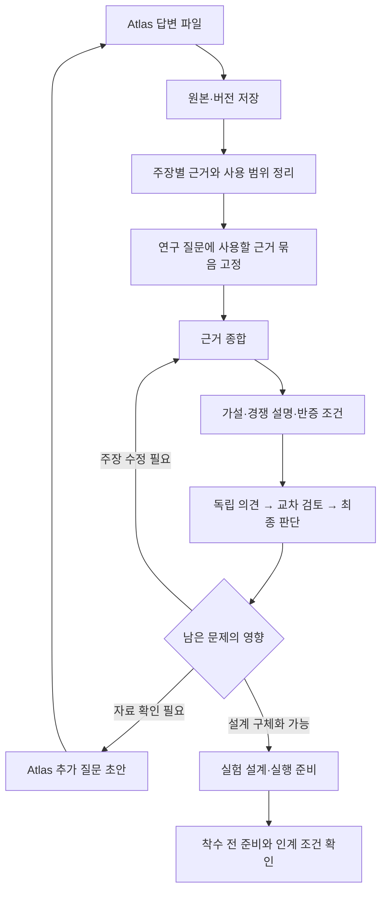

# Atlas 근거를 M1 종합·가설 검토에 연결하기

상태: 구현 전 검토안. 사용자는 외부 근거를 M1 종합·가설·완료 조건에 연결하는 후속 작업의 시작을 요청했다. 이 문서는 그 연결 방식과 작은 구현 단위를 정한다. 기존 [파일 연계 설계](2026-09-12-atlas-file-evidence-design.md)를 확장한다.

## 1. 이번에 해결할 문제

Atlas QA의 원본·사용 판단·결정은 Pilot에 저장되지만, M1 종합은 여전히 자체 screen·collect·extract 기록을 요구한다. 현재 코드의 연결 지점은 다음과 같다.

- `m1_nodes.py`: 종합·가설·검토의 입력 부모가 자체 수집 경로로 고정돼 있다.
- `m1_review.py`: `current_evidence()`의 추출 항목만 주장 근거로 허용한다.
- `handoffs.py`: 자체 수집·추출 노드와 corpus 승인으로 인계 명세를 만든다.

Atlas QA를 저장했다는 이유로 이 조건을 통과시키거나 가상의 수집·추출 기록을 만들면 실제 작업 이력이 왜곡된다. 반대로 기존 자체 수집 조건을 계속 강제하면 Atlas에서 한 작업을 반복해야 한다.

## 2. 선택한 방향과 대안

**권장: 외부 근거 경로를 명시적으로 추가하고, 종합 이후의 검토 규칙은 공통으로 사용한다.**

| 방식 | 장점 | 문제·판단 |
| --- | --- | --- |
| 외부 경로 + 공통 종합·검토 | 출처와 책임을 유지하고 기존 협의 기능 재사용 | 입력 계약과 준비 상태의 확장이 필요. 채택 권장 |
| QA를 기존 collect/extract로 변환 | 기존 부모 관계 유지 | Pilot이 원문을 수집·대조한 것처럼 보일 위험. 채택하지 않음 |
| Atlas 전용 M1 전체 복제 | 기존 경로와 분리 쉬움 | 가설·쟁점·승인 정책이 이중화됨. 채택하지 않음 |

자체 수집 경로도 근거 종합 단계로 들어온다. 외부 경로의 성공이 기존 경로의 완료 상태를 바꾸지는 않는다.

## 3. 첫 구현 단위: 질문에 사용할 근거 묶음

새 순수 정책 모듈 `m1_evidence_basis.py`를 추가한다. 첫 명령은 `m1.evidence_basis.register`로 한다. 기존 immutable 객체·정확한 참조·expected_head·command_id 규칙을 사용한다.

등록 입력:

- `question_ref`: 현재 Pilot 연구 질문 개정의 정확한 참조.
- `question_text`: 해당 개정의 `content.questions`에 실제 존재하는 질문 문장. QA 자체를 Pilot 질문 대신 사용하지 않는다.
- `review_refs`: 선택한 외부 사용 판단의 정확한 참조 목록.
- `claims`: 아래 주장 항목 목록.
- `coverage`: 다룬 범위·빠진 범위·다음 판단에 주는 영향의 설명.
- `limitations`: 묶음 전체의 한계.
- `previous_ref`: 동일 질문 계열의 이전 근거 묶음 참조, 최초에는 null.
- `revision_reason`: 최초에는 null, 개정 시 변경 이유.
- `producer_id`: 실제 작성자 식별자.

각 주장 항목:

| 필드 | 의미 |
| --- | --- |
| claim_id | 묶음 내 고유 식별자 |
| statement | Pilot이 이번 연구에서 사용할 명시적 주장 |
| evidence_ref / review_ref | 정확한 QA 버전과 사용 판단 |
| basis_kind | `atlas_answer` 또는 `pilot_inference` |
| qa_excerpt | QA 답변에 실제 포함되는 인용 구간. 공백 정규화로 없는 문장을 만들어 맞추지 않음 |
| rationale | 해당 구간이 주장을 뒷받침하는 이유. 추론이면 추론 과정을 설명 |
| intended_use | 사용 판단의 allowed_uses 중 하나와 정확히 일치하는 용도 |
| limitations | 일반화 금지·미확인·경쟁 설명 등 |

이 구조는 Atlas의 해석을 논문 저자의 직접 주장으로 자동 승격하지 않는다. PDF 위치·해시는 기존 QA의 선언을 연결해서 보여 준다. 원문 직접 확인 여부는 기존 입력 이력을 따른다.

등록은 원본 보존과 참조 유효성 확인이다. 과학적 타당성·충분성이나 단계 완료를 인증하지 않는다. 의미 판단은 종합·가설의 실제 협의에서 수행한다.

## 4. 입력 검증과 변경 영향

- 묶음과 주장·근거·검토는 같은 Pilot 프로젝트의 실제 등록 이력에 속해야 한다.
- use/limited 판단만 지지 근거로 채택한다. hold/exclude 기록은 보류 이유의 문맥으로 보존하며 지지 근거로 사용할 수 없다.
- 각 주장에는 선택된 검토와 정확히 일치하는 evidence_ref가 있어야 한다.
- QA 인용 구간은 등록된 answer 안에 존재해야 한다. 단순 서지 정보나 후보 목록만으로 본문 근거를 구성하지 않는다.
- 주장용 근거는 현재 QA 버전과 선택한 검토에 고정한다. 등록 전 새 QA가 있으면 새 검토를 요구한다.
- 등록 후 새 QA가 들어오면 기존 묶음·대화·결정은 보존한다. 현재 준비 상태에는 재검토 필요를 표시하고, 영향받는 근거만 새 묶음으로 갱신한다.
- 같은 QA의 여러 주장을 독립 출처로 세지 않는다. 출처의 독립성을 확인하지 못하면 미확인으로 남긴다.
- 서로 다른 사용 판단이 충돌하면 최신 레코드를 임의 선택하지 않는다. 선택된 판단과 제외한 판단의 이유를 명시하고 실제 협의에서 다룬다.
- 자료 수·라운드 수·확신도 점수만으로 준비 완료를 판정하지 않는다.

B1은 외부 전용 묶음부터 지원한다. 자체·외부 근거를 한 묶음에서 혼합하는 기능은 기존 자체 경로를 손대지 않고 후속으로 확장한다. 묶음 선택은 명시적이며 QA 등록만으로 기본 경로를 전환하지 않는다.

## 5. 공통 종합·가설과 연결

B2에서 종합·가설·검토 입력을 두 개의 닫힌 계약으로 검증한다. 기존 자체 경로의 저장 형식과 해시는 유지한다.

- 자체 경로: 기존 부모·추출 참조 규칙 유지.
- 외부 경로: 현재 질문 + 고정된 근거 묶음 + 필요한 직전 종합/가설 참조.

외부 경로는 자체 screen/collect/extract 완료를 요구하지 않는다. 대신 근거 묶음의 유효성·현재 질문과의 일치·사용 범위를 확인한다. 종합의 evidence_refs는 묶음의 주장 객체를 가리키며, 주장 → 사용 판단 → QA 원본으로 추적된다.

내용 작성과 검토 완료를 구분한다. 초안 등록이 가능해도 각 단계는 실제 역할별 협의가 끝나야 검토 완료가 된다. 기존 종합·가설의 경쟁 설명·반증 조건·쟁점 처리 구조를 재사용한다.

## 6. 협의와 단계 완료의 구분

B3에서 기존 council을 정확한 노드 개정에 연결한다. 분야·방법·비판 검토 역할이 동일 근거 묶음을 보고 독립 초기 의견을 제출하고, 전원 제출 후 교차 검토·최종 판단을 수행한다. 조정자가 실제 근거와 미해결 문제를 평가해 필요한 후속 작업을 배정한다.

이전 파일 기반 원응답 9개와 조정자 결정은 참고 이력이다. 새 council 발언이나 단계 승인을 대리 생성하지 않는다. 기존 쟁점은 보존하고 현재 질문·주장·설계에 미치는 영향을 연결한다. 단순한 문서 개정이나 의견 일치를 쟁점 해소로 처리하지 않는다.

준비 상태는 최소한 다음을 분리한다.

1. 근거 묶음 등록 가능/재검토 필요.
2. 종합·가설 검토 진행/완료.
3. 실험 설계·실행 준비 충족 여부.
4. M1 최종 인계 가능 여부.

B1–B3으로 3·4를 완료시키지 않는다. 특히 기존 native M1 handoff를 전체 실험 착수 준비의 증명으로 재해석하지 않는다. B5는 외부 경로의 인계 근거 형식과 필요한 준비 조건을 명시하고, 미구현·미충족 조건은 차단 사유로 보여 준다. 실제 장비·예산·작업자·권한·측정·분석·CSV 계보 준비의 검증 없이 전체 M1 완료를 열지 않는다.

## 7. UI

새 페이지 대신 현재 Atlas 패널과 M1 상세 화면을 연결한다.

- ‘이 연구 질문에 사용할 근거’에 질문·주장·사용 범위·한계를 표시.
- ‘이 주장의 근거 보기’에서 QA 인용 구간과 버전·검토 이유로 이동.
- ‘새 답변이 있어 다시 확인해야 합니다’에는 영향받는 묶음·가설·결정을 연결.
- 수집·추출 화면에는 ‘ResearchAtlas 자료를 연결함’을 별도 상태로 표시. 기존 미실행 노드를 완료 체크로 바꾸지 않음.
- ‘설계 검토를 계속할 수 있음’과 ‘실험 시작 준비 완료’를 구별.
- 과거 기록에서는 해당 시점의 묶음과 판단을 표시하며 새 기록 저장은 잠금.

## 8. 작게 나눈 작업과 완료 기준

| 순서 | 작업 | 사용자가 확인할 결과 | 검사 |
| --- | --- | --- | --- |
| B1 | 질문별 근거 묶음·주장 등록과 조회 | 현재 QA로 어떤 주장을 어디까지 쓸지 추적 가능 | 잘못된 질문·검토·인용·용도·버전 거절, 재시도·과거 보존 |
| B2 | 외부 경로의 종합·가설 입력 연결 | 자체 수집을 반복하지 않고 초안 등록 가능 | 기존 경로 호환, 가짜 추출 없이 연결, 범위 밖 근거 거절 |
| B3 | 실제 협의와 문제 영향 연결 | 라운드별 의견·변경 이유·남은 문제 확인 | 독립 의견 공개 순서, 정확한 입력, 조정자 기록만으로 통과 불가 |
| B4 | 공통 UI·새 버전 재검토 흐름 | 근거→가설→결정 탐색, 변경 영향 표시 | 실브라우저·모바일·과거 보기·입력 보존 |
| B5 | 외부 경로 준비 상태와 인계 정책 | 실험 준비에서 실제 남은 항목 확인 | 준비 조건 누락 시 차단, 과거 인계 보존, 승인·쟁점 자동 생성 없음 |
| B6 | 현재 복합재 사례 적용 | 등록 근거를 실제 연구 질문·가설 검토에 연결 | 실제 데이터와 기능 시험 분리, 단계 상태와 화면 일치 |

첫 구현은 B1이다. B1의 API·참조 계약과 검증이 끝난 뒤 B2를 연결한다. 개별 단위에서는 해당 기능과 직접 의존성 테스트를 수행하고, 전체 연구 그래프 회귀 검사는 공통 단계·인계 변경이 모인 시점에 수행한다. 이전 전체 검사의 실행 시간은 약 18분 37초였으며 작은 문구 수정마다 이를 반복하지 않는다.

## 9. 현재 사례 적용 전 확인

현재 연구에는 QA·사용 판단·조정자 결정·추가 질문 각 1건이 등록돼 있다. 사용 판단의 question_ref는 Atlas QA를 가리킨다. B1에서는 이것을 자동으로 현재 Pilot 질문에 치환하지 않는다. 근거 묶음에서 정확한 Pilot 질문과 관련성을 명시한다.

현재 HEAD `97bbb95b1d60936c3d51276a1b849bf74ca4f35439ba02605ae8a069c77d44a3`의 질문을 직접 조회했다. 세 질문은 새 문헌 예측, 가설 선택법의 성과, 실행 전 검사의 효과다. 이번 ‘동일 배합의 두 제조 조건 비교’는 등록된 질문 문장에 없다. 따라서 B6에서 기존 세 질문을 보존하면서 사례 질문을 추가하는 개정과 실제 검토를 먼저 수행한다. 이 차이를 감추고 옛 질문의 완료 조건을 통과시키지 않는다. 질문 개정으로 영향을 받는 기존 단계는 재검토 필요로 표시하고 과거 결과를 보존한다.

## 10. 이번 설계에서 제외하는 것

Atlas API/MCP·자동 질문 전송, 원문 재수집, 혼합 근거 묶음, 실제 실험, 자동 CSV 수신, 실행 권한 생성은 포함하지 않는다. 기존 쟁점·원본·승인·개정 이력은 변경하지 않는다.

설계 자체 점검: 기존 저장 형식 유지, 외부 경로의 명시적 선택, 근거 등록과 과학적 검토 분리, M1 실행 준비의 별도 조건, 현재 질문 불일치와 개정 순서를 확인했다. 구현 코드는 아직 변경하지 않았다.
