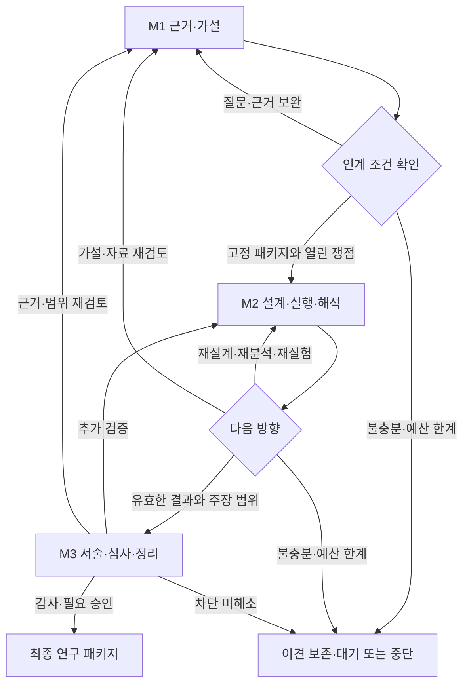
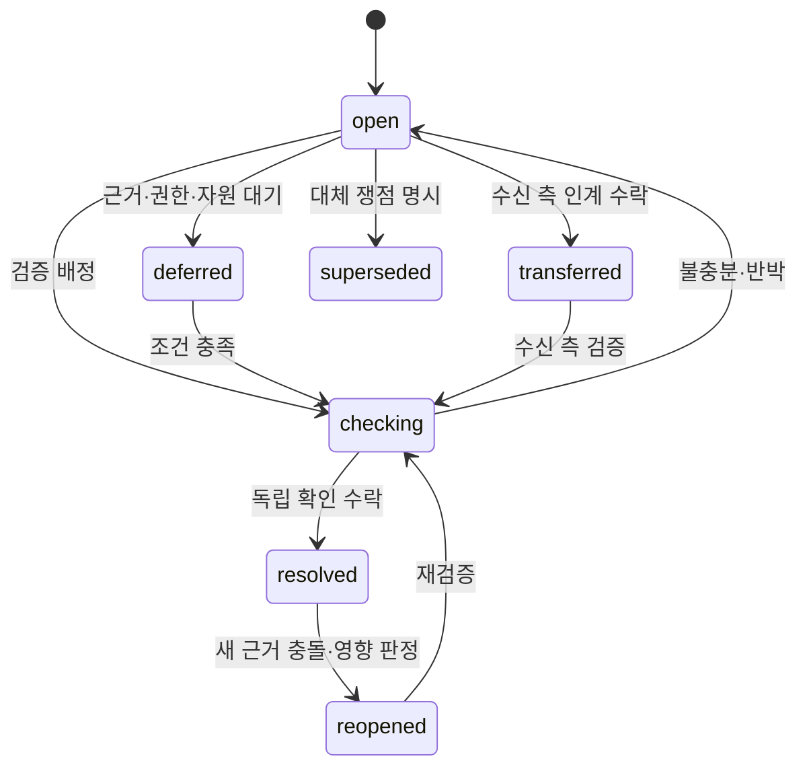

# 쟁점 생명주기·변경 영향·예산

[설계 목차](../2026-09-09-research-governance-design.md) · 이 문서의 해당 기준만 읽고, 다른 항목은 필요한 경우에만 참조한다.

## 3. 전체 흐름과 쟁점 생명주기

각 화살표는 구체적인 milestone/node/attempt를 지정한다. 전체 마일스톤 초기화를 뜻하지 않는다.

superseded는 후속 issue_id가 필수이며 해소로 계산하지 않는다. 쟁점 병합·분할도 원본을 남기고 successor_ids를 연결한다. 상태 변경은 append-only event이며 임의 status 덮어쓰기를 제공하지 않는다. transferred 기록에는 to_milestone, owner_assignment_id, verification_id, acceptance_event_id가 필요하다.

## 7. 재검증·예산·실패

변경 영향은 정확한 버전 Dependency의 후손에서 계산한다. 기록은 삭제하지 않고 needs_revalidation을 새 이벤트로 남긴다. 새 분석으로 영향을 받는 도표·주장·최종 승인만 다시 검토한다. 영향 밖 객체와 승인 binding은 재사용한다.

반복 기준은 milestone/node + 질문 + 의미가 고정된 입력 refs + 작업/판정 기준이다. 새 UUID, 문구만 바꾼 동일 작업, 역할 교체는 새 근거로 계산하지 않는다. 근거 해석 오류 수정 등 새 자료 없는 유효한 작업은 correction_ref로 구별한다. 자연어 의미 동등성은 완전 자동 판정하지 않으며 의심 사례를 reasons와 함께 검토 대기로 둔다.

예산은 max_returns, max_verification_runs, execution_cost_limit(optional), observed_cost, cost_status로 나눈다. 비용을 관측하지 못하면 unknown이며 0으로 표시하지 않는다. 한계 소진은 blocked_budget; 권한/입력 부족은 awaiting_input; 실행 실패는 failed; 불충분 결과는 inconclusive다. 어느 것도 completed로 바꾸지 않는다.

동일 command_id+동일 payload는 원래 receipt를 반환하고 중복 실행하지 않는다. 다른 payload는 conflict. stale expected_head는 충돌, 잘못된 객체·역할·해시·기한 지난 승인은 등록 거부 및 HEAD 보존. 읽기 실패·서버 단절은 UI의 마지막 검증된 snapshot을 유지한다.
